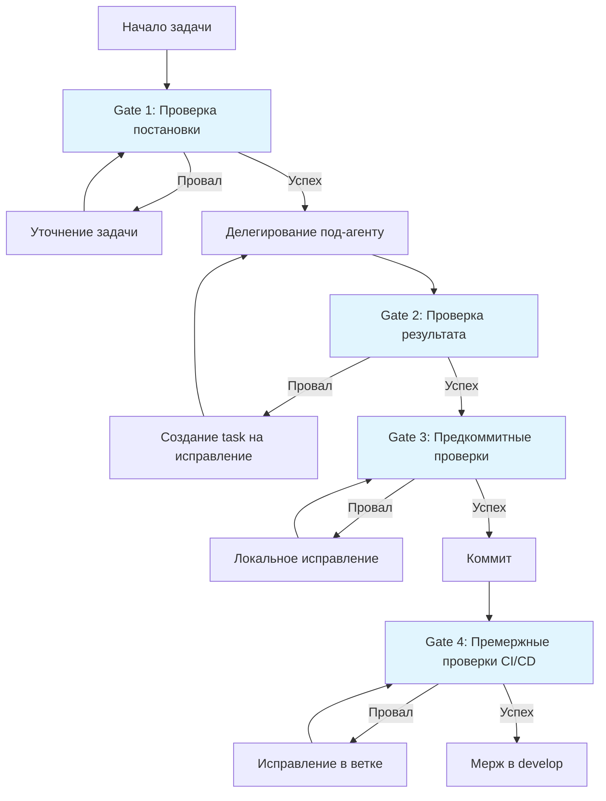

# Контрольные точки качества (Quality Gates)

## 1. Философия
Качество проверяется на каждом этапе разработки, а не в конце. **Невозможно** пропустить этап с непройденными проверками. Каждая контрольная точка (gate) — это обязательный барьер, который должен быть преодолен перед переходом к следующему этапу разработки.

## 2. Контрольные точки

### 2.1. Gate 1: Перед запуском любого под-агента (Pre-Execution Gate)
**Цель**: Убедиться, что задача корректно поставлена и может быть эффективно выполнена.

**Проверки**:
- [ ] **Четкие критерии завершения**: В описании задачи есть конкретные, измеримые критерии успеха
- [ ] **Правильный выбор агента**: `subagent_type` соответствует типу задачи (например, не используем `tech-translator-ru` для исправления багов)
- [ ] **Полный контекст в промпте**: В поле `prompt` включены: релевантные фрагменты кода, ссылки на файлы, предыдущие решения по теме
- [ ] **Определен объем работы**: Указаны конкретные файлы/директории для работы, исключено "распыление"
- [ ] **Нет противоречий**: Задача не противоречит существующей архитектуре и принятым решениям

**Действие при провале**: Уточнить задачу, дополнить контекст, исправить промпт. **Не запускать `task`**.

**Пример проверки оркестратором**:
```bash
# Проверка, что промпт содержит необходимые элементы
!grep -q "контекст\|context" state/current_task_prompt.md || echo "WARNING: Контекст отсутствует в промпте"
```

### 2.2. Gate 2: После выполнения под-агента (Post-Execution Gate)
**Цель**: Верифицировать, что результат работы под-агента корректен и не вредит системе.

**Проверки**:
- [ ] **Синтаксическая корректность**: 
  ```bash
  # Для Python
  !python -m py_compile workspace/src/module.py 2>&1 | head -20
  
  # Для TypeScript
  !npx tsc --noEmit --project workspace/ 2>&1 | head -20
  ```

- [ ] **Линтинг не выявляет критических ошибок**:
  ```bash
  # Для Python (Ruff)
  !ruff check workspace/src/ --output-format=concise | grep -E "(E|F)[0-9]+" | head -10
  
  # Для TypeScript (ESLint)
  !npx eslint workspace/src/file.ts --format=compact | grep -E "error|Error" | head -10
  ```

- [ ] **Существующие тесты не сломаны**:
  ```bash
  # Запуск только тестов, связанных с измененными файлами
  !pytest workspace/tests/ -xvs -k "test_module" 2>&1 | tail -30
  ```

- [ ] **Визуальный осмотр изменений**: Оркестратор читает ключевые измененные файлы, проверяет на очевидные ошибки
- [ ] **Соответствие задаче**: Результат соответствует исходным требованиям из `prompt`

**Действие при провале**: Создать новый `task` для исправления с детальным описанием обнаруженных проблем.

### 2.3. Gate 3: Перед коммитом (Pre-Commit Gate)
**Цель**: Обеспечить, что код, попадающий в историю Git, соответствует всем стандартам качества.

**Проверки**:
- [ ] **Форматирование**:
  ```bash
  # Python
  !ruff format workspace/ --check 2>&1 | grep -q "check" && echo "Форматирование необходимо" || echo "OK"
  
  # TypeScript
  !npx prettier --check "workspace/src/**/*.{ts,tsx}" 2>&1 | tail -5
  ```

- [ ] **Линтинг (строгий режим)**:
  ```bash
  # Python - без ошибок
  !ruff check workspace/ --select=E,F --exit-non-zero-on-fix 2>/dev/null && echo "Линтинг OK" || echo "Есть ошибки"
  
  # TypeScript - без ошибок
  !npx eslint workspace/src/ --max-warnings=0 2>&1 | grep -c "error" | awk '{if ($1==0) print "OK"; else print "Есть ошибки"}'
  ```

- [ ] **Проверка типов**:
  ```bash
  # Python (mypy)
  !mypy workspace/src/ --no-error-summary 2>&1 | grep -c "error:" | awk '{if ($1==0) print "Типы OK"; else print "Ошибки типов"}'
  
  # TypeScript
  !npx tsc --noEmit --project workspace/ 2>&1 | grep -c "error" | awk '{if ($1==0) print "Типы OK"; else print "Ошибки типов"}'
  ```

- [ ] **Все юнит-тесты проходят**:
  ```bash
  !pytest workspace/tests/unit/ -v --tb=short 2>&1 | tail -20 | grep -E "(PASSED|FAILED|ERROR)"
  ```

- [ ] **Сборка проекта**:
  ```bash
  # Для проектов со сборкой
  !cd workspace && npm run build 2>&1 | tail -30
  # или
  !cd workspace && python -m build 2>&1 | tail -30
  ```

**Действие при провале**: Исправить проблемы, **не создавая коммит**. При необходимости делегировать `code-quality-checker` или `bug-fixer`.

### 2.4. Gate 4: Перед мержем в develop (Pre-Merge Gate)
**Цель**: Обеспечить стабильность основной ветки разработки.

**Проверки**:
- [ ] **Интеграционные тесты**:
  ```bash
  !pytest workspace/tests/integration/ -v 2>&1 | grep -E "(passed|failed|error)" | tail -10
  ```

- [ ] **Проверка безопасности**:
  ```bash
  # Python (bandit)
  !bandit -r workspace/src/ -f json 2>/dev/null | python -c "import json,sys; data=json.load(sys.stdin); errors=[i for i in data['results'] if i['issue_confidence']=='HIGH']; print(f'Найдено {len(errors)} высокоприоритетных уязвимостей')"
  
  # npm audit для JS/TS
  !cd workspace && npm audit --audit-level=high 2>&1 | grep -E "(high|critical)" || echo "Уязвимостей высокого уровня не найдено"
  ```

- [ ] **Проверка зависимостей**:
  ```bash
  # Проверка устаревших зависимостей
  !cd workspace && npm outdated 2>&1 | grep -E "(MAJOR|Critical)" || echo "Критических обновлений нет"
  ```

- [ ] **Code coverage не ниже порога** (если настроено):
  ```bash
  !pytest workspace/tests/ --cov=workspace/src/ --cov-fail-under=80 2>&1 | grep -E "(TOTAL|FAIL)"
  ```

- [ ] **Ревью кода завершено**: В `state/review_status.md` есть отметка об approval

**Действие при провале**: Отклонить PR, вернуть на доработку. Создать задачи для исправления.

## 3. Техническая реализация проверок

### 3.1. Автоматические проверки в CI/CD
```yaml
# Файл: .github/workflows/quality-gates.yml
name: Quality Gates
on:
  push:
    branches: [main, develop]
  pull_request:
    branches: [develop]

jobs:
  quality-gates:
    runs-on: ubuntu-latest
    strategy:
      matrix:
        python-version: ["3.11"]
        node-version: ["20.x"]
    
    steps:
    - uses: actions/checkout@v4
    
    - name: Setup Python
      uses: actions/setup-python@v4
      with:
        python-version: ${{ matrix.python-version }}
    
    - name: Setup Node.js
      uses: actions/setup-node@v4
      with:
        node-version: ${{ matrix.node-version }}
    
    - name: Install Python dependencies
      run: |
        pip install ruff mypy pytest bandit
        if [ -f "workspace/requirements.txt" ]; then
          pip install -r workspace/requirements.txt
        fi
    
    - name: Install Node.js dependencies
      if: exists('workspace/package.json')
      run: |
        cd workspace
        npm ci
    
    - name: Gate 3 checks (Pre-Commit)
      run: |
        echo "=== Проверка форматирования ==="
        ruff format workspace/ --check
        
        echo "=== Линтинг ==="
        ruff check workspace/ --output-format=github
        
        echo "=== Проверка типов (Python) ==="
        mypy workspace/src/ --no-error-summary
        
        echo "=== Запуск тестов ==="
        pytest workspace/tests/ -v --tb=short
        
        echo "=== Проверка безопасности ==="
        bandit -r workspace/src/ -f json -o bandit-report.json || true
    
    - name: Upload quality report
      uses: actions/upload-artifact@v3
      if: always()
      with:
        name: quality-report
        path: |
          bandit-report.json
          workspace/coverage.xml
```

### 3.2. Локальные скрипты для оркестратора
```bash
#!/bin/bash
# Файл: scripts/run_quality_gate.sh
# Использование: !./scripts/run_quality_gate.sh <gate_number> [path]

GATE=$1
TARGET_PATH=${2:-"workspace/"}

echo "Запуск Quality Gate $GATE для пути: $TARGET_PATH"

case $GATE in
  1)
    echo "=== Gate 1: Pre-Execution Checks ==="
    # Проверка структуры task
    if [ ! -f "state/current_task.json" ]; then
      echo "ERROR: Не найден файл задачи state/current_task.json"
      exit 1
    fi
    
    # Проверка наличия обязательных полей
    !python -c "
import json
with open('state/current_task.json') as f:
    task = json.load(f)
required = ['subagent_type', 'description', 'prompt']
missing = [r for r in required if r not in task]
if missing:
    print(f'ERROR: Отсутствуют поля: {missing}')
    exit(1)
if len(task.get('prompt', '')) < 50:
    print('ERROR: Промпт слишком краток (менее 50 символов)')
    exit(1)
print('Gate 1 пройдена: задача корректно сформирована')
"
    ;;
    
  2)
    echo "=== Gate 2: Post-Execution Checks ==="
    
    # Python проверки
    if find "$TARGET_PATH" -name "*.py" | head -1 | grep -q ".py"; then
      echo "Проверка Python файлов..."
      !ruff check "$TARGET_PATH" --select=E,F --exit-non-zero-on-fix 2>/dev/null || {
        echo "WARNING: Найдены ошибки линтинга"
      }
      
      # Проверка синтаксиса
      !python -m py_compile $(find "$TARGET_PATH" -name "*.py" | head -3) 2>&1 | head -5
    fi
    
    # TypeScript проверки
    if find "$TARGET_PATH" -name "*.ts" -o -name "*.tsx" | head -1 | grep -q ".ts"; then
      echo "Проверка TypeScript файлов..."
      !npx tsc --noEmit --project "$TARGET_PATH" 2>&1 | head -10
    fi
    
    echo "Gate 2: базовые проверки завершены"
    ;;
    
  3)
    echo "=== Gate 3: Pre-Commit Checks ==="
    
    # Запуск всех строгих проверок
    echo "1. Форматирование..."
    !ruff format "$TARGET_PATH" --check
    
    echo "2. Линтинг (строгий)..."
    !ruff check "$TARGET_PATH" --output-format=github
    
    echo "3. Проверка типов..."
    if [ -d "${TARGET_PATH}src" ]; then
      !mypy "${TARGET_PATH}src" --no-error-summary
    fi
    
    echo "4. Запуск тестов..."
    if [ -d "${TARGET_PATH}tests" ]; then
      !pytest "${TARGET_PATH}tests" -v --tb=short 2>&1 | tail -20
    fi
    
    echo "Gate 3 проверки инициированы"
    ;;
    
  *)
    echo "Неизвестный номер gate: $GATE"
    echo "Доступные gates: 1 (Pre-Execution), 2 (Post-Execution), 3 (Pre-Commit)"
    exit 1
    ;;
esac
```

## 4. Роль под-агентов в обеспечении качества

### 4.1. Агенты-аудиторы и их специализация
- **`code-quality-checker`**: 
  - Проверяет стиль кода, сложность функций, наличие документации
  - Генерирует отчеты в `state/quality_audits/`
  - **Критерии**: PEP 8 (Python), Airbnb Style Guide (JS/TS), цикломатическая сложность < 15

- **`security-orchestrator`**:
  - Ищет уязвимости (SQL-инъекции, XSS, небезопасные десериализации)
  - Проверяет конфигурации на безопасность
  - **Критерии**: Нет high/critical уязвимостей в отчете

- **`bug-hunter`**:
  - Ищет логические ошибки, edge cases, потенциальные race conditions
  - Анализирует покрытие тестами
  - **Критерии**: Все найденные critical баги исправлены

### 4.2. Приоритизация проблем из отчетов агентов
```yaml
# state/quality_priorities.yaml (пример приоритизации)
priority_levels:
  critical:
    action: "Немедленное исправление, блокирует мерж"
    examples: ["security vulnerability", "crash bug", "data loss"]
    timeframe: "1 час"
    
  high:
    action: "Исправить в текущем PR/таске"
    examples: ["performance regression", "broken feature", "high severity bug"]
    timeframe: "24 часа"
    
  medium:
    action: "Исправить в следующем спринте"
    examples: ["code smell", "tech debt", "non-critical bug"]
    timeframe: "1 неделя"
    
  low:
    action: "Исправить при наличии времени"
    examples: ["typo in comments", "cosmetic issue", "nice-to-have improvement"]
    timeframe: "1 месяц"
```

## 5. Метрики качества

### 5.1. Отслеживаемые метрики и целевые значения
```json
{
  "code_quality": {
    "test_coverage": {
      "target": "> 80%",
      "current": "78%",
      "trend": "↑"
    },
    "lint_errors": {
      "target": "0 critical, < 10 minor",
      "current": "0 critical, 5 minor",
      "trend": "↓"
    },
    "type_coverage": {
      "target": "> 90%",
      "current": "92%",
      "trend": "→"
    }
  },
  "performance": {
    "build_time": {
      "target": "< 3 min",
      "current": "2m 45s",
      "trend": "→"
    },
    "test_time": {
      "target": "< 5 min",
      "current": "3m 20s",
      "trend": "↓"
    }
  },
  "security": {
    "vulnerabilities": {
      "target": "0 critical, 0 high",
      "current": "0 critical, 1 high",
      "trend": "↓"
    }
  }
}
```

### 5.2. Панель мониторинга качества
```python
#!/usr/bin/env python3
# Файл: scripts/generate_quality_report.py
# Генерация отчета о качестве (запускается периодически)

import json
from datetime import datetime
from pathlib import Path

def generate_quality_report():
    report = {
        "timestamp": datetime.utcnow().isoformat(),
        "metrics": {},
        "gates_passed": {},
        "recommendations": []
    }
    
    # Анализ логов quality gates
    log_path = Path("state/quality_logs/")
    if log_path.exists():
        gate_results = []
        for log_file in log_path.glob("gate_*.log"):
            with open(log_file) as f:
                content = f.read()
                passed = "FAILED" not in content and "ERROR" not in content
                gate_results.append({
                    "gate": log_file.stem,
                    "passed": passed,
                    "last_check": log_file.stat().st_mtime
                })
        report["gates_passed"] = gate_results
    
    # Сохранение отчета
    report_path = Path("state/quality_reports/")
    report_path.mkdir(exist_ok=True)
    
    report_file = report_path / f"quality_report_{datetime.utcnow().strftime('%Y%m%d')}.json"
    with open(report_file, 'w') as f:
        json.dump(report, f, indent=2, ensure_ascii=False)
    
    print(f"Отчет сохранен: {report_file}")

if __name__ == "__main__":
    generate_quality_report()
```

## 6. Эскалация проблем

### 6.1. Уровни эскалации при проблемах с качеством
```
[Проблема обнаружена]
        ↓
Уровень 1: Автоматическое исправление
        • ruff --fix, prettier --write
        • Автоматический рефакторинг
        ↓ (если не решено)
        
Уровень 2: Делегирование специалисту
        • code-quality-checker для проблем стиля
        • bug-fixer для логических ошибок
        • security-orchestrator для уязвимостей
        ↓ (если не решено)
        
Уровень 3: Вмешательство оркестратора
        • Прямое исправление кода
        • Анализ корневой причины
        • Обновление документации/тестов
        ↓ (если не решено)
        
Уровень 4: Консультация с пользователем
        • Вопрос с конкретными вариантами
        • Запрос дополнительного контекста
        • Предложение альтернативных подходов
```

### 6.2. Workflow с качеством (полный цикл)


## 7. Интеграция с системой оркестрации

### 7.1. Автоматический запуск проверок
```bash
#!/bin/bash
# Файл: scripts/auto_quality_check.sh
# Оркестратор запускает эту проверку после каждого task

TASK_RESULT=$1
AGENT_TYPE=$2

echo "Автоматическая проверка качества после $AGENT_TYPE"

# Gate 2 проверки
./scripts/run_quality_gate.sh 2

# Специфичные проверки для типа агента
case $AGENT_TYPE in
  "code-quality-checker")
    # Дополнительные проверки для аудитора качества
    if [ -f "state/quality_audits/latest.md" ]; then
      !grep -q "CRITICAL" "state/quality_audits/latest.md" && echo "Качество приемлемо" || echo "Найдены критические проблемы"
    fi
    ;;
    
  "security-orchestrator")
    # Проверка безопасности
    if [ -f "state/security_scan.json" ]; then
      !python -c "
import json
with open('state/security_scan.json') as f:
    scan = json.load(f)
high_vulns = [v for v in scan.get('vulnerabilities', []) if v.get('severity') in ['HIGH', 'CRITICAL']]
if high_vulns:
    print(f'ВНИМАНИЕ: Найдено {len(high_vulns)} высокоприоритетных уязвимостей')
    exit(1)
else:
    print('Критических уязвимостей не найдено')
"
    fi
    ;;
esac

echo "Автопроверка завершена"
```

---
*Эти контрольные точки являются обязательными для всех задач в системе. Оркестратор должен явно проверять каждую точку перед переходом к следующему этапу. Результаты проверок фиксируются в `state/quality_logs/` для последующего анализа.*
