# 🏗️ Обзор архитектуры

## Содержание

- [Системная архитектура](#системная-архитектура)
- [Отношения компонентов](#отношения-компонентов)
- [Паттерны рабочих процессов](#паттерны-рабочих-процессов)
- [Структура файлов](#структура-файлов)
- [Поток данных](#поток-данных)
- [Принципы проектирования](#принципы-проектирования)

---

## Системная архитектура

### Обзор высокого уровня

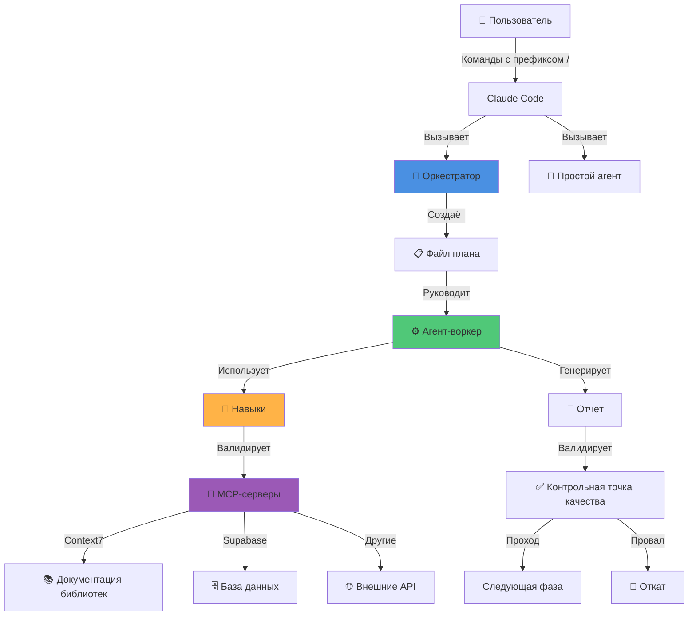

---

## Отношения компонентов

### Экосистема агентов

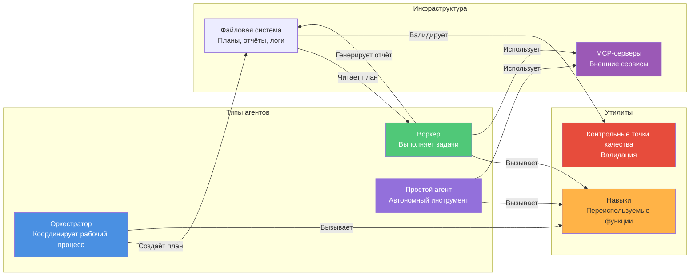

### Иерархия категорий

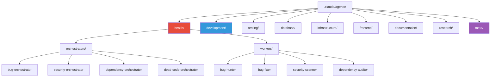

---

## Паттерны рабочих процессов

### 1. Паттерн возврата управления (PD-1)

**Основной паттерн**, предотвращающий вложенность контекста:

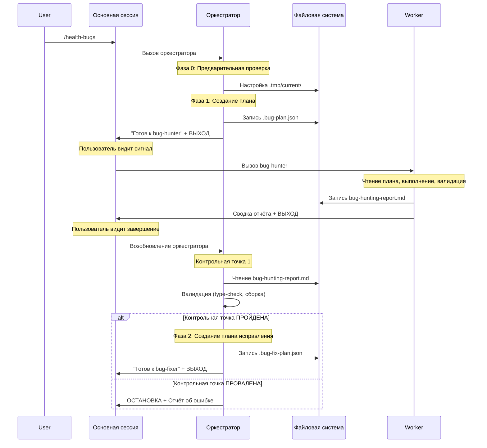

**Почему возврат управления?**
- ✅ Предотвращает вложенность контекста (контекст воркера остаётся изолированным)
- ✅ Обеспечивает возможность отката (чёткое разделение фаз)
- ✅ Предотвращает бесконечные циклы (основная сессия управляет вызовами)
- ✅ Видимость для пользователя (видит завершение каждой фазы)

---

### 2. Паттерн контрольной точки качества

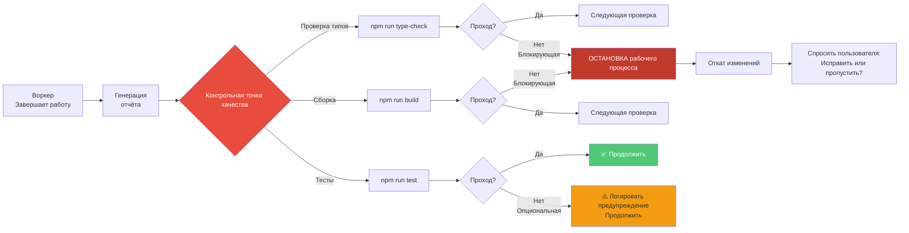

**Конфигурация контрольной точки качества** в файлах плана:

```json
{
  "validation": {
    "required": ["проверка типов", "сборка"],
    "optional": ["тесты", "линт"]
  }
}
```

---

### 3. Паттерн итеративного рабочего процесса

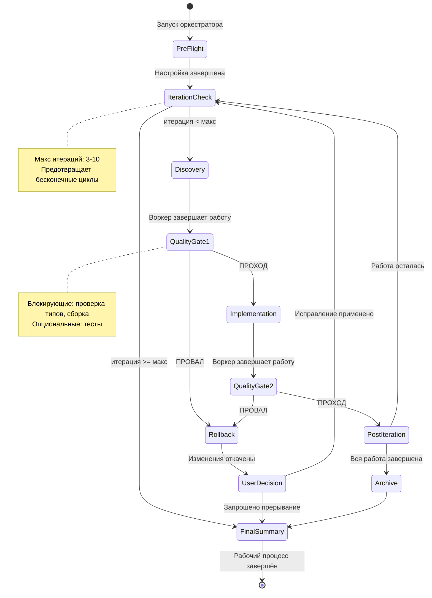

**Пример**: bug-orchestrator запускает до 3 итераций:
1. Итерация 1: Найти баги → Исправить критические/высокие
2. Итерация 2: Проверка верификации → Исправить оставшиеся
3. Итерация 3: Финальная проверка → Отчёт

---

## Структура файлов

### Структура директорий

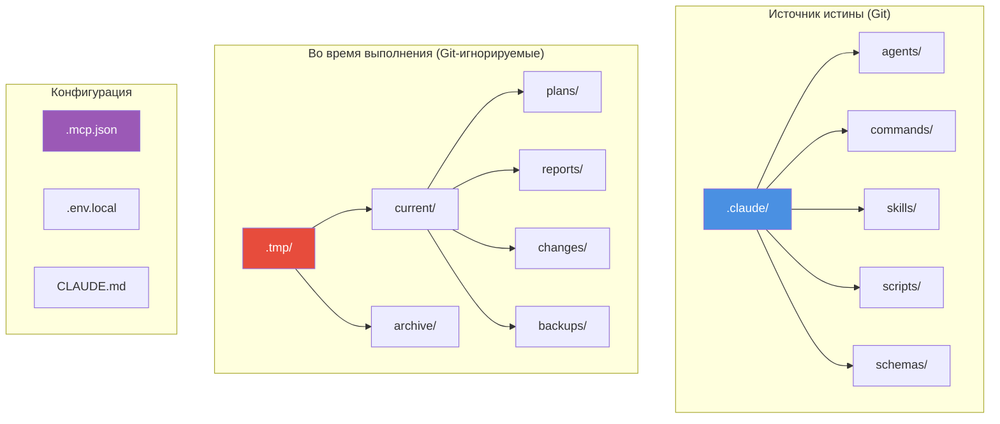

### Поток файлов во время рабочего процесса

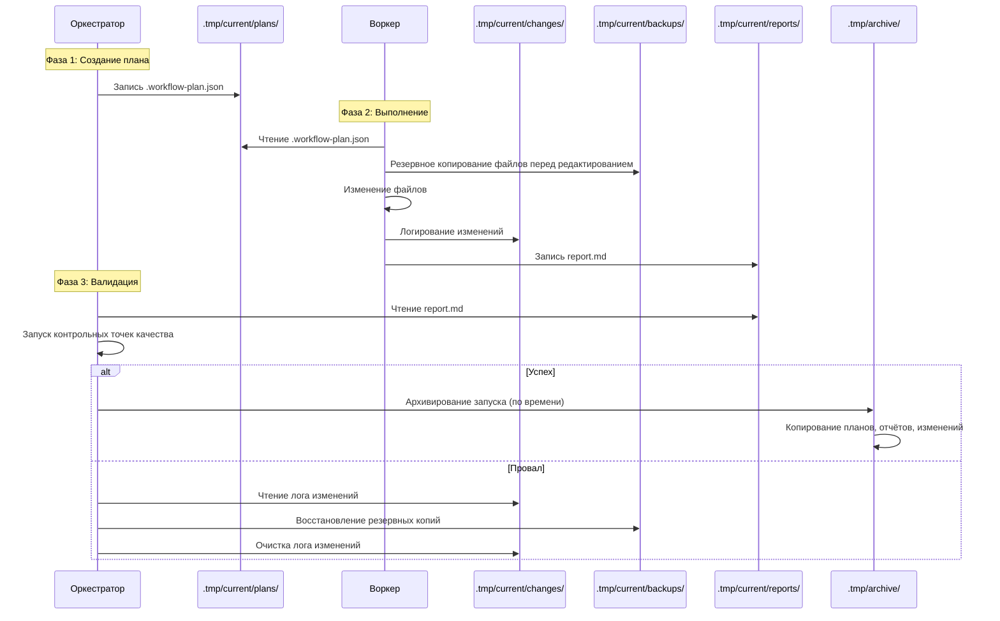

---

## Поток данных

### Файл плана → Воркер → Отчёт

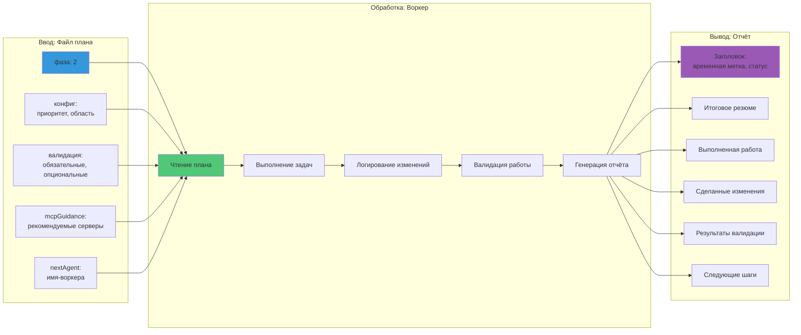

### Интеграция MCP-сервера

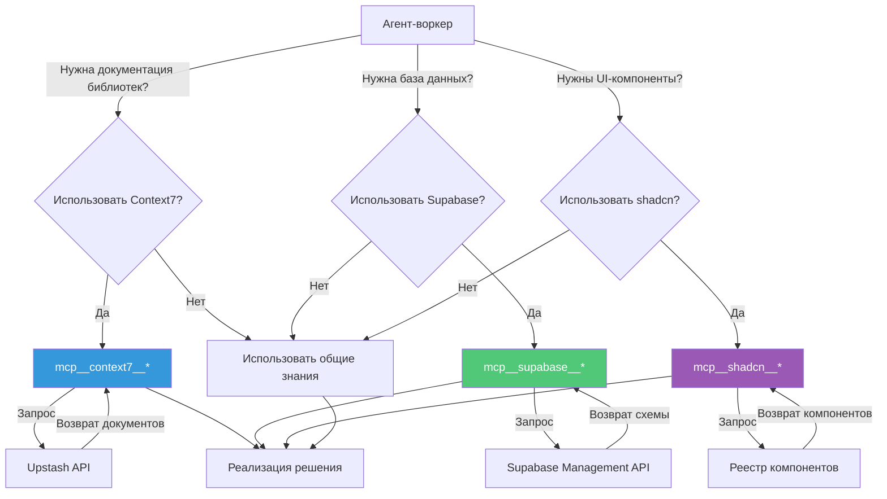

---

## Принципы проектирования

### 1. Единственная ответственность

**Каждый компонент имеет одну ясную цель:**

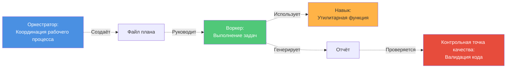

**Анти-паттерн**: Оркестратор выполняет реализационную работу (нарушает SRP)

---

### 2. Разделение ответственности

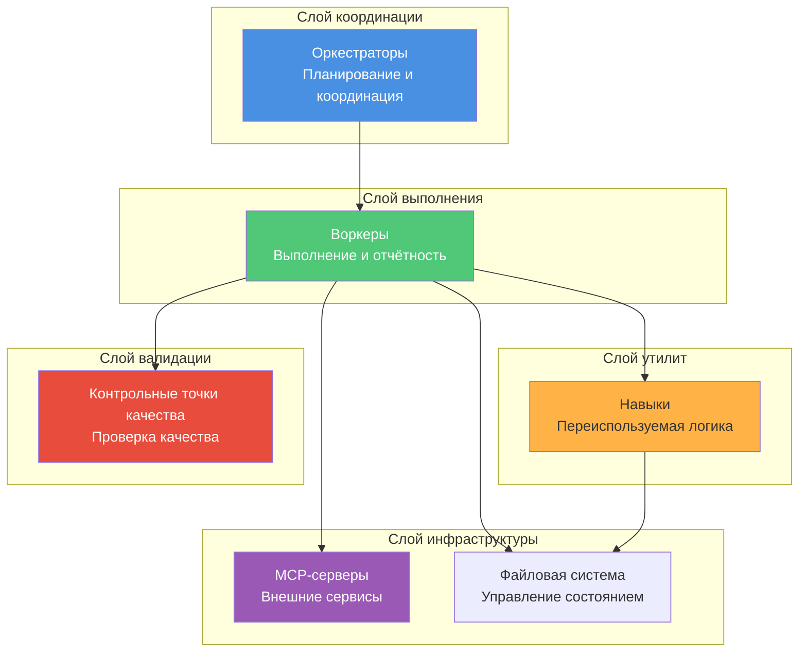

---

### 3. Быстрый отказ с откатом

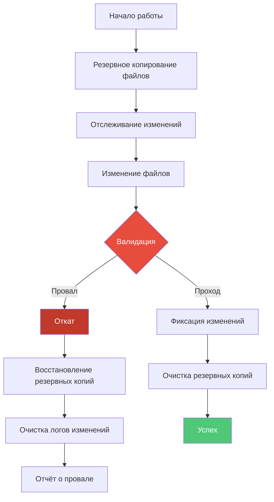

**Реализация**:
- Все изменения логируются в `.tmp/current/changes/*.json`
- Оригинальные файлы резервируются в `.tmp/current/backups/`
- Навык `rollback-changes` откатывает все модификации

---

### 4. Наблюдаемые рабочие процессы

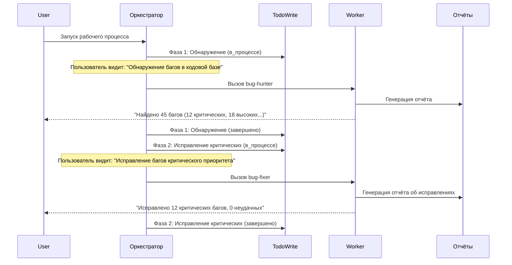

**Функции наблюдаемости**:
- Обновления TodoWrite (прогресс в реальном времени)
- Выполнение по фазам (чёткие этапы)
- Подробные отчёты (аудит-трак)
- Запросы пользователю при критических решениях

---

### 5. Плавная деградация

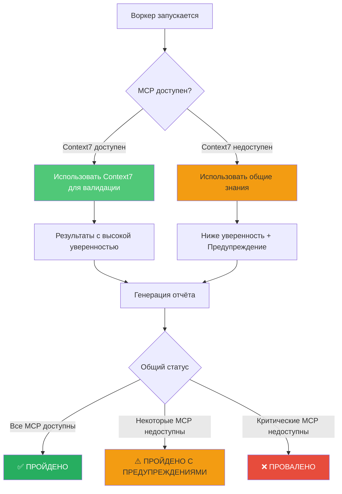

**Стратегия отката**:
- Context7 недоступен → Использовать общие знания + уменьшить уверенность
- Провал контрольной точки качества → Запрос пользователю (исправить/пропустить/прервать)
- Макс итераций → Генерация сводки с частичными результатами
- Бюджет токенов исчерпан → Упрощённый режим → Аварийный выход

---

## Архитектура конфигурации MCP

### Уровни конфигурации

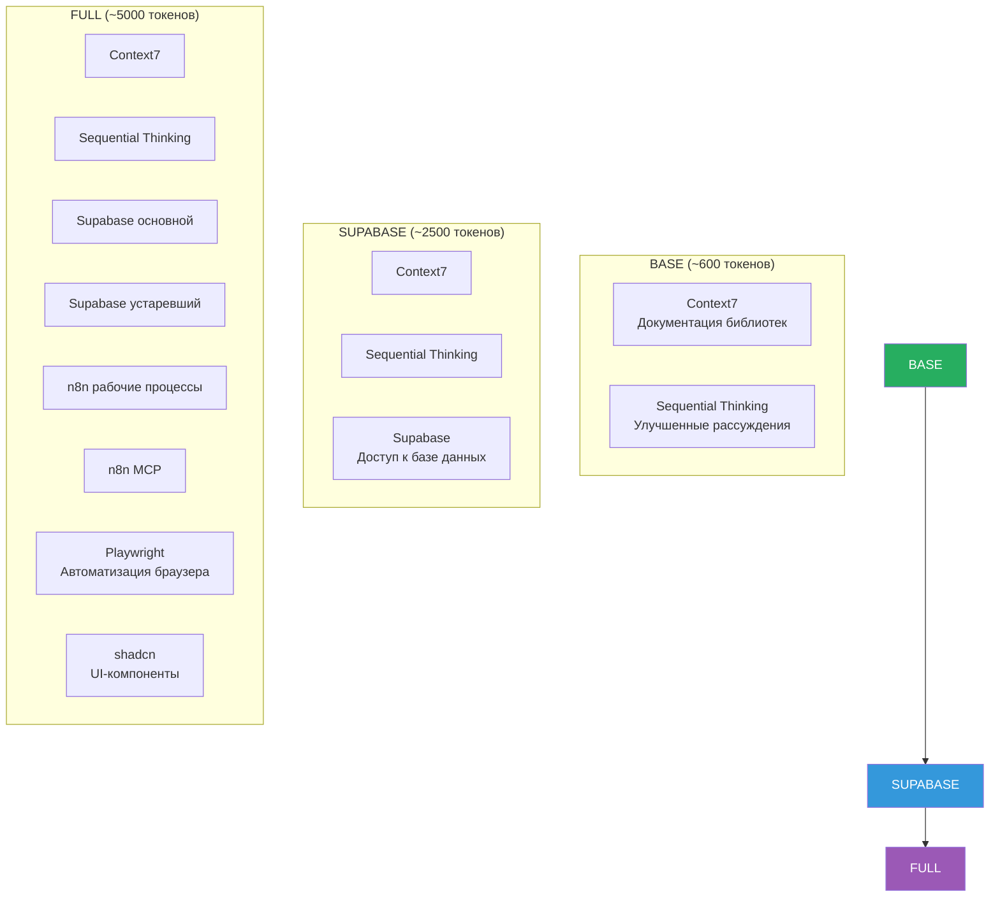

### Дерево принятия решений по выбору конфигурации

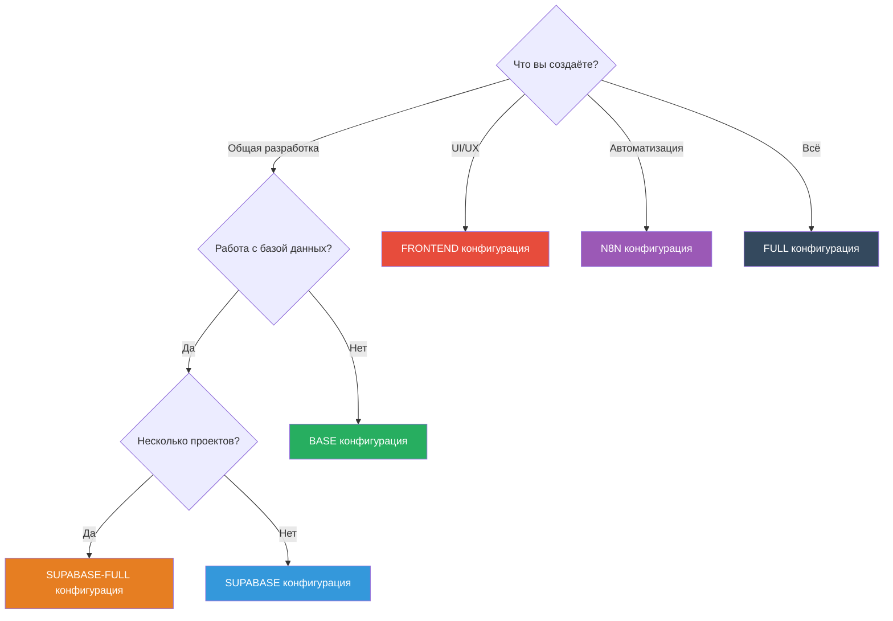

---

## Архитектура поведенческой ОС (CLAUDE.md)

### Обеспечение основных директив

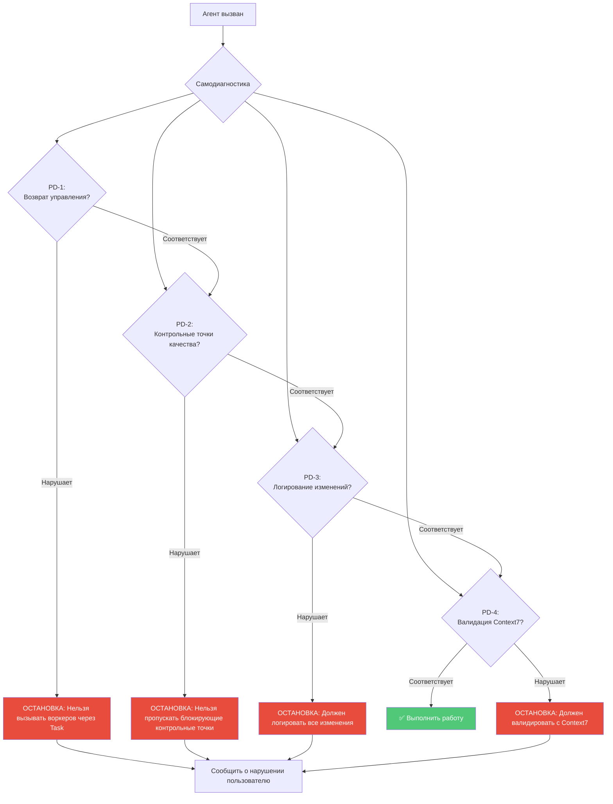

---

## Summary

### Key Architectural Patterns

1. **Return Control Pattern** — Prevents context nesting, enables rollback
2. **Quality Gates** — Automated validation checkpoints
3. **Iterative Workflows** — Bounded loops with max iterations
4. **Plan → Execute → Report** — Standardized communication protocol
5. **Graceful Degradation** — Fallback strategies for failures
6. **Observability** — TodoWrite, reports, logs for transparency
7. **Fail-Fast with Rollback** — Detect errors early, restore state
8. **Behavioral OS (CLAUDE.md)** — Constitutional rules for all agents

### Component Summary

| Component | Purpose | Count | Examples |
|-----------|---------|-------|----------|
| **Orchestrators** | Coordinate multi-phase workflows | 4 | bug-orchestrator, security-orchestrator |
| **Workers** | Execute specific tasks from plans | 25+ | bug-hunter, bug-fixer, security-scanner |
| **Simple Agents** | Standalone utilities | 4+ | code-reviewer, technical-writer |
| **Skills** | Reusable utility functions | 15+ | run-quality-gate, validate-plan-file |
| **MCP Configs** | External service integrations | 6 | BASE, SUPABASE, FULL |
| **Quality Gates** | Validation scripts | 3+ | check-bundle-size, check-security |

---

## Related Documentation

- **Tutorial**: [TUTORIAL-CUSTOM-AGENTS.md](./TUTORIAL-CUSTOM-AGENTS.md) — Create custom agents
- **Use Cases**: [USE-CASES.md](./USE-CASES.md) — Real-world examples
- **Performance**: [PERFORMANCE-OPTIMIZATION.md](./PERFORMANCE-OPTIMIZATION.md) — Token optimization
- **FAQ**: [FAQ.md](./FAQ.md) — Common questions
- **Behavioral OS**: [../CLAUDE.md](../CLAUDE.md) — Prime Directives and contracts
- **Detailed Specs**: [Agents Ecosystem/](./Agents%20Ecosystem/) — Full specifications

---

**Architecture Version**: 3.0
**Last Updated**: 2025-01-11
**Maintained by**: [Igor Maslennikov](https://github.com/maslennikov-ig)
