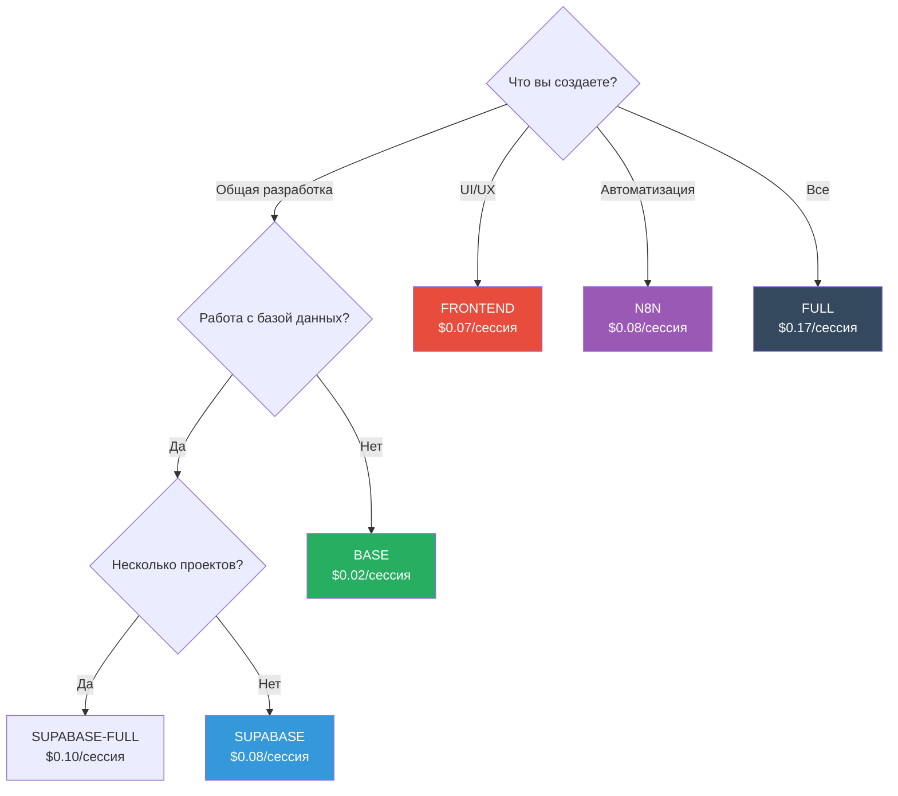

# ⚡ Руководство по оптимизации производительности и токенов

## Содержание

- [Использование токенов по конфигурациям](#использование-токенов-по-конфигурациям)
- [Стратегии оптимизации затрат](#стратегии-оптимизации-затрат)
- [Выбор конфигурации MCP](#выбор-конфигурации-mcp)
- [Оптимизация рабочих процессов](#оптимизация-рабочих-процессов)
- [Лучшие практики](#лучшие-практики)

---

## Использование токенов по конфигурациям

### Сравнение конфигураций

| Конфигурация | Токены/сессия | Серверы | Стоимость/сессия | Сценарии использования |
|--------------|---------------|---------|------------------|------------------------|
| **BASE** | ~600 | 2 | $0.02 | Ежедневная разработка, ревью кода, рефакторинг |
| **SUPABASE** | ~2,500 | 3 | $0.08 | Проектирование баз данных, политики RLS, SQL-запросы |
| **SUPABASE-FULL** | ~3,000 | 4 | $0.10 | Работа с несколькими проектами баз данных |
| **N8N** | ~2,500 | 4 | $0.08 | Автоматизация рабочих процессов, интеграция n8n |
| **FRONTEND** | ~2,000 | 4 | $0.07 | UI/UX, тестирование Playwright, компоненты ShadCN |
| **FULL** | ~5,000 | 8 | $0.17 | Сложная работа с множественными интеграциями |

**Расчет стоимости**: На основе цен Claude Sonnet 4.5 (~$3/миллион входных токенов, ~$15/миллион выходных токенов)

---

## Стратегии оптимизации затрат

### 1. Использовать конфигурацию BASE по умолчанию

**Рекомендация**: Используйте конфигурацию BASE 80% времени, переключайтесь только при необходимости.

**Пример экономии**:
```
# ❌ Использование FULL весь день (8 часов, 20 сессий)
20 сессий × $0.17 = $3.40/день × 22 дня = $74.80/месяц

# ✅ Использование в основном BASE (16 BASE + 4 SUPABASE сессии)
16 × $0.02 + 4 × $0.08 = $0.64/день × 22 = $14.08/месяц

# Экономия: $60.72/месяц на разработчика
# Для команды из 10 человек: $607.20/месяц = $7,286.40/год
```

### 2. Динамическое переключение конфигураций

```bash
# Начать день с BASE
./switch-mcp.sh  # Выбрать опцию 1 (BASE)

# Переключиться на SUPABASE для работы с базой данных
./switch-mcp.sh  # Выбрать опцию 2 (SUPABASE)
# ... выполнить работу с базой данных ...

# Вернуться к BASE
./switch-mcp.sh  # Выбрать опцию 1 (BASE)
```

### 3. Использовать специализированные конфигурации только при необходимости

| Задача | Неправильная конфигурация | Правильная конфигурация | Экономия |
|--------|--------------------------|------------------------|----------|
| Ревью кода | FULL ($0.17) | BASE ($0.02) | 88% |
| Исправление багов | FULL ($0.17) | BASE ($0.02) | 88% |
| Проектирование баз данных | FULL ($0.17) | SUPABASE ($0.08) | 53% |
| Прототипирование UI | FULL ($0.17) | FRONTEND ($0.07) | 59% |
| Рабочие процессы n8n | FULL ($0.17) | N8N ($0.08) | 53% |

### 4. Мониторинг использования токенов

**Отслеживание использования по конфигурациям:**
```bash
# Добавить в ~/.zshrc или ~/.bashrc
alias mcp-base='./switch-mcp.sh -s base && echo "РЕЖИМ BASE: ~$0.02/сессия"'
alias mcp-supabase='./switch-mcp.sh -s supabase && echo "РЕЖИМ SUPABASE: ~$0.08/сессия"'
alias mcp-full='./switch-mcp.sh -s full && echo "РЕЖИМ FULL: ~$0.17/сессия ПРЕДУПРЕЖДЕНИЕ: Высокая стоимость"'
```

---

## Выбор конфигурации MCP

### Дерево решений



### Рекомендации по конфигурациям по задачам

#### Ежедневные задачи разработки

| Задача | Рекомендуемая конфигурация | Стоимость | Альтернатива |
|--------|---------------------------|-----------|--------------|
| Ревью кода | BASE | $0.02 | — |
| Рефакторинг | BASE | $0.02 | — |
| Исправление багов | BASE | $0.02 | — |
| Написание тестов | BASE | $0.02 | — |
| Документация | BASE | $0.02 | — |

**Экономия по сравнению с FULL**: 88% ($0.15 за сессию)

#### Задачи баз данных

| Задача | Рекомендуемая конфигурация | Стоимость | Альтернатива |
|--------|---------------------------|-----------|--------------|
| Проектирование схемы | SUPABASE | $0.08 | FULL ($0.17) |
| Политики RLS | SUPABASE | $0.08 | FULL ($0.17) |
| SQL-запросы | SUPABASE | $0.08 | FULL ($0.17) |
| Миграции | SUPABASE | $0.08 | FULL ($0.17) |
| Несколько проектов | SUPABASE-FULL | $0.10 | FULL ($0.17) |

**Экономия по сравнению с FULL**: 53-70%

#### Задачи фронтенда

| Задача | Рекомендуемая конфигурация | Стоимость | Альтернатива |
|--------|---------------------------|-----------|--------------|
| Прототипирование UI | FRONTEND | $0.07 | FULL ($0.17) |
| Проектирование компонентов | FRONTEND | $0.07 | FULL ($0.17) |
| Тестирование браузера | FRONTEND | $0.07 | FULL ($0.17) |
| Доступность | FRONTEND | $0.07 | FULL ($0.17) |

**Экономия по сравнению с FULL**: 59%

---

## Оптимизация рабочих процессов

### Паттерн 1: Начинать с малого, расширять по мере необходимости

```bash
# ✅ Оптимальный рабочий процесс
1. Начать с конфигурации BASE
2. Определить необходимость специализированного MCP
3. Переключиться на специализированную конфигурацию
4. Выполнить задачу
5. Переключиться обратно на BASE

# ❌ Расточительный рабочий процесс
1. Использовать конфигурацию FULL весь день
2. Платить в 5-8 раз больше без выгоды
```

### Паттерн 2: Группировка похожих задач

```bash
# ✅ Эффективная группировка
# Переключиться на SUPABASE один раз, выполнить всю работу с базой данных
./switch-mcp.sh -s supabase
- Проектирование схемы
- Написание политик RLS
- Создание миграций
- Тестирование запросов
./switch-mcp.sh -s base

# ❌ Неэффективное переключение
# Переключаться несколько раз для одной области
./switch-mcp.sh -s supabase  # Проектирование схемы
./switch-mcp.sh -s base
./switch-mcp.sh -s supabase  # Написание политик (расточительное переключение)
./switch-mcp.sh -s base
```

### Паттерн 3: Планирование дня

```bash
# Утро: Работа с базой данных (SUPABASE)
09:00 - 11:00: Проектирование схемы, политики RLS

# Середина дня: Общая разработка (BASE)
11:00 - 15:00: Исправление багов, рефакторинг, ревью кода

# После обеда: Работа с UI (FRONTEND)
15:00 - 17:00: Проектирование компонентов, тестирование браузера

# Общая стоимость:
# SUPABASE: 4 сессии × $0.08 = $0.32
# BASE: 8 сессий × $0.02 = $0.16
# FRONTEND: 4 сессии × $0.07 = $0.28
# Итого в день: $0.76

# по сравнению с использованием FULL весь день:
# FULL: 16 сессий × $0.17 = $2.72
# Экономия: $1.96/день = $43.12/месяц = $517.44/год на разработчика
```

---

## Лучшие практики

### 1. По умолчанию использовать BASE

**Правило**: Если вы не уверены, какую конфигурацию использовать, используйте BASE.

**Обоснование**: BASE обрабатывает 80% задач по 12% стоимости FULL.

### 2. Измерять перед оптимизацией

**Отслеживать использование в течение 1 недели:**
```bash
# Создать простой журнал
echo "$(date): Используется конфигурация BASE" >> ~/.mcp-usage.log

# Проверить еженедельно
cat ~/.mcp-usage.log | sort | uniq -c
```

**Анализ**:
- Какая конфигурация используется чаще всего?
- Есть ли ненужное использование FULL?
- Возможности группировать задачи?

### 3. Руководящие принципы команды

**Установить стандарты команды:**
```markdown
# Политика конфигурации MCP команды

## Конфигурация по умолчанию
- Использовать **BASE** для всей общей разработки

## Когда переключаться
- **SUPABASE**: Схема базы данных, политики RLS, SQL-запросы
- **FRONTEND**: Проектирование UI, тестирование браузера (Playwright)
- **N8N**: Только автоматизация рабочих процессов
- **FULL**: Только с одобрения лидера команды

## Целевые показатели стоимости
- Средняя стоимость/разработчик/месяц: < $20
- Если превышает $30/месяц: Проверить использование с лидером команды
```

### 4. Автоматизация переключения

**Создать удобные псевдонимы:**
```bash
# Добавить в ~/.zshrc или ~/.bashrc

# Быстрые псевдонимы переключения
alias mcp='./switch-mcp.sh'
alias mcp:base='./switch-mcp.sh -s base && echo "✅ РЕЖИМ BASE ($0.02/сессия)"'
alias mcp:db='./switch-mcp.sh -s supabase && echo "✅ РЕЖИМ SUPABASE ($0.08/сессия)"'
alias mcp:ui='./switch-mcp.sh -s frontend && echo "✅ РЕЖИМ FRONTEND ($0.07/сессия)"'
alias mcp:full='./switch-mcp.sh -s full && echo "⚠️  РЕЖИМ FULL ($0.17/сессия - ВЫСОКАЯ СТОИМОСТЬ)"'

# Показать текущую конфигурацию
alias mcp:show='cat .mcp.json | grep "mcpServers" | head -5'
```

### 5. Оптимизация CI/CD

**Использовать BASE в конвейерах CI/CD:**
```yaml
# .github/workflows/health-check.yml
env:
  MCP_CONFIG: base  # Использовать BASE для CI (самый дешевый)

jobs:
  health-check:
    steps:
      - name: Запустить проверки состояния
        run: |
          cp mcp/.mcp.base.json .mcp.json
          claude-code /health-bugs
```

**Обоснование**: CI/CD не нуждается в дорогих MCP, BASE достаточно.

---

## Сценарии затрат

### Сценарий 1: Один разработчик

**Шаблон использования:**
- 8 часов/день программирования
- 20 сессий/день
- 22 рабочих дня/месяц

**Базовый уровень (FULL весь день):**
```
20 сессий × $0.17 = $3.40/день
$3.40 × 22 = $74.80/месяц
```

**Оптимизированный (BASE 80%, SUPABASE 20%):**
```
16 сессий BASE × $0.02 = $0.32
4 сессии SUPABASE × $0.08 = $0.32
Итого: $0.64/день × 22 = $14.08/месяц
```

**Экономия**: $60.72/месяц = $728.64/год

---

### Сценарий 2: Маленькая команда (5 разработчиков)

**Шаблон использования на разработчика:**
- BASE: 16 сессий/день
- SUPABASE: 3 сессии/день
- FRONTEND: 1 сессия/день

**Ежемесячная стоимость на разработчика:**
```
BASE: 16 × 22 × $0.02 = $7.04
SUPABASE: 3 × 22 × $0.08 = $5.28
FRONTEND: 1 × 22 × $0.07 = $1.54
Итого: $13.86/разработчик/месяц
```

**Стоимость команды:**
```
5 разработчиков × $13.86 = $69.30/месяц
```

**по сравнению с использованием FULL:**
```
5 разработчиков × 20 сессий × 22 дня × $0.17 = $374/месяц
```

**Экономия**: $304.70/месяц = $3,656.40/год

---

### Сценарий 3: Команда предприятия (20 разработчиков)

**Шаблон использования:**
- Смешанное использование BASE, SUPABASE, FRONTEND, N8N
- Средняя стоимость: $15/разработчик/месяц

**Стоимость команды:**
```
20 разработчиков × $15 = $300/месяц = $3,600/год
```

**по сравнению с использованием FULL:**
```
20 разработчиков × $74.80 = $1,496/месяц = $17,952/год
```

**Экономия**: $14,352/год

---

## Управление бюджетом токенов

### Протоколы аварийной ситуации

Из CLAUDE.md (Поведенческая ОС):

**При 180k токенов (90% бюджета):**
- Агенты автоматически упрощают рабочие процессы
- Минимальные отчеты (только основные разделы)
- Только основные запросы Context7
- Без необязательных проверок

**При 195k токенов (97.5% бюджета):**
- НЕМЕДЛЕННО ОСТАНОВИТЬ рабочий процесс
- Сгенерировать аварийное резюме
- Выход с достоинством
- Пользователь начинает новую сессию

**Стратегии предотвращения:**

1. **Использовать конфигурацию BASE** (экономия 90% по сравнению с FULL)
2. **Периодически очищать контекст** (команда `/clear`)
3. **Разбивать большие рабочие процессы** на более мелкие части
4. **Динамическое переключение конфигураций** (не использовать FULL весь день)

---

## Мониторинг и аналитика

### Отслеживание использования MCP

**Простой сценарий отслеживания:**
```bash
#!/bin/bash
# сохранить как: scripts/track-mcp-usage.sh

CONFIG=$(cat .mcp.json | jq -r '.mcpServers | keys | @csv' | tr -d '"')
TIMESTAMP=$(date '+%Y-%m-%d %H:%M:%S')
COST=0

case $CONFIG in
  *context7*server-sequential-thinking*)
    COST=0.02
    NAME="BASE"
    ;;
  *supabase*)
    COST=0.08
    NAME="SUPABASE"
    ;;
  *playwright*)
    COST=0.07
    NAME="FRONTEND"
    ;;
  *)
    COST=0.17
    NAME="FULL"
    ;;
esac

echo "$TIMESTAMP,$NAME,$COST" >> ~/.mcp-usage-log.csv
```

**Ежемесячный отчет:**
```bash
#!/bin/bash
# Генерировать ежемесячный отчет использования

echo "Отчет об использовании MCP - $(date '+%B %Y')"
echo "========================================"
echo ""

awk -F',' '
BEGIN { base=0; supabase=0; frontend=0; full=0; }
/BASE/ { base+=$3 }
/SUPABASE/ { supabase+=$3 }
/FRONTEND/ { frontend+=$3 }
/FULL/ { full+=$3 }
END {
  total = base + supabase + frontend + full
  printf "BASE:      $%.2f (%.1f%%)\n", base, (base/total)*100
  printf "SUPABASE:  $%.2f (%.1f%%)\n", supabase, (supabase/total)*100
  printf "FRONTEND:  $%.2f (%.1f%%)\n", frontend, (frontend/total)*100
  printf "FULL:      $%.2f (%.1f%%)\n", full, (full/total)*100
  printf "\nИтого:     $%.2f\n", total
}
' ~/.mcp-usage-log.csv
```

---

## Резюме

### Ключевые выводы

1. **Использовать BASE по умолчанию** — 80% задач, 12% стоимости FULL
2. **Динамическое переключение** — Использовать специализированные конфигурации только при необходимости
3. **Группировка похожих задач** — Минимизировать переключения конфигураций
4. **Планирование дня** — Группировать задачи по требованиям MCP
5. **Мониторинг использования** — Отслеживать затраты, оптимизировать шаблоны с высоким использованием

### Сравнение стоимости

| Подход | Ежемесячная стоимость (на разработчика) | Экономия по сравнению с FULL |
|--------|-----------------------------------------|------------------------------|
| FULL весь день | $74.80 | 0% (базовый уровень) |
| Оптимизированный (BASE 80%) | $14.08 | 81% |
| Оптимизированный (политика команды) | $15.00 | 80% |

### ROI

**Инвестиции**: Время на изучение переключения MCP (~1 час)
**Возврат**: $60-70/месяц на разработчика
**Срок окупаемости**: < 1 день

---

## Дополнительные ресурсы

- **FAQ**: [FAQ.md](./FAQ.md) — Вопросы по конфигурации MCP
- **Архитектура**: [ARCHITECTURE.md](./ARCHITECTURE.md) — Проектирование системы
- **Миграция**: [MIGRATION-GUIDE.md](./MIGRATION-GUIDE.md) — Руководство по настройке

---

**Версия документа**: 1.0
**Последнее обновление**: 2025-01-11
**Поддерживается**: [Игорь Масленников](https://github.com/maslennikov-ig)
