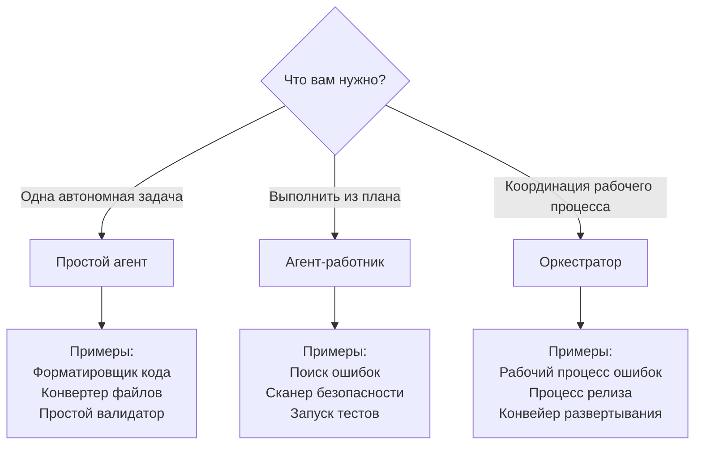

# 🎓 Руководство: Создание пользовательских агентов

## Содержание

- [Введение](#introduction)
- [Предварительные требования](#prerequisites)
- [Быстрый старт с мета-агентом](#quick-start-with-meta-agent)
- [Создание агента вручную](#manual-agent-creation)
- [Руководство 1: Простой агент](#tutorial-1-simple-agent)
- [Руководство 2: Агент-работник](#tutorial-2-worker-agent)
- [Руководство 3: Агент-оркестратор](#tutorial-3-orchestrator-agent)
- [Руководство 4: Создание навыка](#tutorial-4-creating-a-skill)
- [Лучшие практики](#best-practices)
- [Тестирование вашего агента](#testing-your-agent)
- [Устранение неполадок](#troubleshooting)

---

## Введение

Это руководство научит вас создавать пользовательские агенты для Claude Code Orchestrator Kit. Вы узнаете:

- Разницу между типами агентов (Простой, Работник, Оркестратор)
- Как использовать мета-агента для автоматического создания
- Как создавать агентов вручную, следуя шаблонам ARCHITECTURE.md
- Лучшие практики проектирования агентов
- Как тестировать и отлаживать ваших агентов

**Время на выполнение**: 30-60 минут на каждое руководство

---

## Предварительные требования

### Необходимые знания

- Базовое понимание Markdown
- Знакомство с Claude Code
- Понимание области вашего проекта

### Дополнительные знания (полезные)

- TypeScript/JavaScript (для контрольных точек качества)
- Рабочие процессы Git
- Концепции тестирования

### Настройка

Убедитесь, что у вас есть:
```bash
# 1. Установленный Claude Code Orchestrator Kit
ls .claude/agents/

# 2. Активная конфигурация MCP
cat .mcp.json

# 3. Доступны CLAUDE.md и ARCHITECTURE.md
ls CLAUDE.md docs/Agents\ Ecosystem/ARCHITECTURE.md
```

---

## Быстрый старт с мета-агентом

**Самый быстрый способ** создать агентов — использовать мета-агента:

### Пошагово

```
1. Спросите Claude Code:
   "Create a worker agent for linting TypeScript files with ESLint"

2. Мета-агент спросит:
   - Тип агента? (работник/оркестратор/простой)
   - Категория области? (здоровье/разработка/тестирование и т.д.)
   - Дополнительные детали, специфичные для типа

3. Мета-агент:
   - Прочитает шаблоны ARCHITECTURE.md
   - Сгенерирует файл агента с правильной структурой
   - Проверит по чек-листу
   - Запишет в .claude/agents/{category}/{type}/{name}.md

4. Проверьте сгенерированного агента:
   - Проверьте YAML frontmatter
   - Проверьте фазы/инструкции
   - Настройте логику области при необходимости

5. Протестируйте агента:
   "Use eslint-worker to lint src/ directory"
```

### Пример взаимодействия

```
Пользователь: Создать агента-работника для форматирования кода с помощью Prettier

Мета-агент: Я создам агента-работника для форматирования кода. Давайте соберем требования:

1. Тип агента: Работник
2. Область: разработка
3. Назначение: Форматировать код с помощью Prettier
4. Входные данные: Пути к файлам или каталогам
5. Выходные данные: Отформатированные файлы + отчет
6. Проверка: Проверить, что форматирование последовательно

[Генерирует агента по шаблону работника...]

✅ Работник создан: .claude/agents/development/workers/prettier-formatter.md

Компоненты:
- YAML frontmatter ✓
- 5-фазная структура ✓
- Интеграция MCP (Context7 для рекомендаций по конфигурации) ✓
- Обработка ошибок ✓

Следующие шаги:
1. Проверьте .claude/agents/development/workers/prettier-formatter.md
2. Настройте параметры Prettier при необходимости
3. Протестируйте с: "Use prettier-formatter on src/"
```

---

## Создание агента вручную

Для полного контроля создавайте агентов вручную, следуя этим шагам.

### Шаг 1: Выберите тип агента

| Тип | Когда использовать | Сложность |
|------|----------|------------|
| **Простой агент** | Одна задача, без координации | Низкая |
| **Работник** | Выполнить конкретную задачу из файла плана | Средняя |
| **Оркестратор** | Координировать многофазный рабочий процесс | Высокая |

**Дерево решений:**



### Шаг 2: Создать файл

```bash
# Простой агент
touch .claude/agents/my-agent.md

# Агент-работник
mkdir -p .claude/agents/{domain}/workers/
touch .claude/agents/{domain}/workers/my-worker.md

# Оркестратор
mkdir -p .claude/agents/{domain}/orchestrators/
touch .claude/agents/{domain}/orchestrators/my-orchestrator.md
```

### Шаг 3: Добавить YAML frontmatter

```yaml
---
name: my-agent-name
description: Use proactively for {task}. Expert in {domain}. Handles {scenarios}.
model: sonnet
color: cyan
---
```

**Цветовые коды по области:**
- `blue` - Здоровье/Качество
- `cyan` - Мета/Инструменты
- `green` - Успех/Проверка
- `purple` - Инфраструктура
- `orange` - Разработка

### Шаг 4: Следовать шаблону

См. руководства ниже для конкретных шаблонов.

---

## Руководство 1: Простой агент

**Цель**: Создать агента форматирования кода, который запускает Prettier для указанных файлов.

### Шаг 1: Планирование агента

**Требования:**
- Входные данные: Пути к файлам или каталогам
- Действие: Запустить prettier с конфигурацией проекта
- Выходные данные: Отформатированные файлы + сводка
- Обработка ошибок: Сообщить о файлах, которые не удалось обработать

### Шаг 2: Создать файл

```bash
touch .claude/agents/prettier-formatter.md
```

### Шаг 3: Написать агента

```markdown
---
name: prettier-formatter
description: Use proactively for code formatting with Prettier. Expert in consistent code style. Handles JavaScript, TypeScript, JSON, Markdown files.
model: sonnet
color: orange
---

# Форматировщик Prettier

Простой агент, который форматирует файлы кода с использованием Prettier с конфигурацией проекта.

## Когда использовать

- Перед фиксацией кода
- После рефакторинга
- Когда стиль кода несогласован
- При адаптации новых участников команды

## Входные данные

Пользователь указывает:
- **Файлы**: Конкретные пути к файлам (например, `src/utils/helper.ts`)
- **Каталоги**: Форматировать все файлы в каталоге (например, `src/`)
- **Шаблоны glob**: Сопоставление шаблонов (например, `src/**/*.ts`)

## Инструкции

1. **Проверить доступность Prettier**
   ```bash
   which prettier || npx prettier --version
   ```
   Если не найден, используйте `npx prettier`.

2. **Проверить наличие конфигурации Prettier**
   - Искать: `.prettierrc`, `.prettierrc.json`, `prettier.config.js`
   - Если найден, использовать конфигурацию проекта
   - Если не найден, использовать значения по умолчанию

3. **Форматировать файлы**
   ```bash
   npx prettier --write {файлы или каталоги}
   ```

4. **Проверить наличие ошибок**
   - Если форматирование прошло успешно → Сообщить об успехе
   - Если ошибки синтаксиса → Сообщить, какие файлы не удалось обработать

5. **Сгенерировать сводку**
   ```
   ✅ Форматирование кода завершено

   Отформатировано: 42 файла
   Не удалось: 2 файла (ошибки синтаксиса)

   Отформатированные файлы:
   - src/utils/helper.ts
   - src/components/Button.tsx
   - ...

   Файлы с ошибками:
   - src/broken.ts (SyntaxError: Неожиданный токен)
   ```

## Формат вывода

**Успех:**
```
✅ Отформатировано {N} файлов успешно
```

**Частичный успех:**
```
⚠️ Отформатировано {N} файлов, {M} не удалось
См. подробности об ошибках выше
```

**Ошибка:**
```
❌ Форматирование не удалось
Prettier не найден или ошибка конфигурации
```

## Обработка ошибок

- **Prettier не установлен**: Установить через `npm install -D prettier`
- **Ошибки синтаксиса**: Сообщить о файлах, не останавливать (форматировать остальные)
- **Ошибки конфигурации**: Использовать значения по умолчанию с предупреждением
- **Ошибки разрешений**: Сообщить о недоступных файлах

## Примеры

### Форматировать один файл
```
Use prettier-formatter on src/utils/helper.ts
```

### Форматировать каталог
```
Use prettier-formatter on src/components/
```

### Форматировать с glob
```
Use prettier-formatter on "src/**/*.{ts,tsx}"
```

---

**Это простой агент**: Без файлов плана, без отчетов, прямое выполнение.
```

### Шаг 4: Протестировать агента

```
# Тест с одним файлом
Спросите Claude Code: "Use prettier-formatter on src/index.ts"

# Тест с каталогом
Спросите Claude Code: "Use prettier-formatter on src/"

# Проверить вывод
Проверьте, что файлы отформатированы правильно
```

### Ключевые выводы

**Простые агенты:**
- ✅ Автономные, без координации
- ✅ Прямой ввод от пользователя
- ✅ Немедленное выполнение
- ✅ Простой формат вывода
- ❌ Без файлов плана
- ❌ Без структурированных отчетов
- ❌ Без контрольных точек качества

---

## Руководство 2: Агент-работник

**Цель**: Создать работника покрытия тестов, который анализирует покрытие тестов из файла плана.

### Шаг 1: Планирование работника

**Требования:**
- Входные данные: Файл плана (`.test-coverage-plan.json`)
- План содержит: Порог (%), каталоги для проверки
- Действие: Запустить инструмент покрытия, проанализировать результаты
- Выходные данные: Структурированный отчет с проходом/неудачей
- Контрольные точки качества: Покрытие должно соответствовать порогу

### Шаг 2: Создать файл

```bash
mkdir -p .claude/agents/testing/workers/
touch .claude/agents/testing/workers/test-coverage-analyzer.md
```

### Шаг 3: Написать работника

```markdown
---
name: test-coverage-analyzer
description: Use proactively for test coverage analysis. Expert in code coverage metrics. Analyzes coverage reports and validates against thresholds.
model: sonnet
color: green
---

# Анализатор покрытия тестов

Агент-работник, который анализирует покрытие тестов из отчетов о покрытии и проверяет соответствие порогам, указанным в файле плана.

## Назначение

Вызывается оркестраторами для проверки соответствия покрытия тестов стандартам качества во время:
- Рабочих процессов исправления ошибок
- Разработки функций
- Проверки релиза
- CI/CD конвейеров

## Фаза 1: Чтение файла плана

**Расположение**: `.tmp/current/plans/.test-coverage-plan.json`

**Ожидаемая структура:**
```json
{
  "phase": 1,
  "config": {
    "threshold": 80,
    "directories": ["src/", "lib/"],
    "excludePatterns": ["**/*.test.ts", "**/*.spec.ts"]
  },
  "validation": {
    "required": ["coverage-check"],
    "optional": []
  },
  "nextAgent": "test-coverage-analyzer"
}
```

**Шаги:**
1. Прочитать файл плана из `.tmp/current/plans/.test-coverage-plan.json`
2. Извлечь `threshold` (минимальный %, требуемый)
3. Извлечь `directories` (пути для проверки)
4. Извлечь `excludePatterns` (файлы для игнорирования)
5. Проверить, что в плане есть требуемые поля

**Если план отсутствует:**
- Создать план по умолчанию:
  ```json
  {
    "threshold": 70,
    "directories": ["src/"],
    "excludePatterns": []
  }
  ```
- Записать предупреждение: "Файл плана отсутствует, используются значения по умолчанию"

## Фаза 2: Генерация отчета о покрытии

**Шаги:**

1. **Запустить инструмент покрытия**
   ```bash
   npm run test:coverage
   # Или: npx jest --coverage
   # Или: npx vitest run --coverage
   ```

2. **Найти отчет о покрытии**
   - Искать: `coverage/coverage-summary.json`
   - Или: `coverage/lcov.info`
   - Разобрать данные о покрытии

3. **Извлечь метрики**
   - **Строки**: % покрытых строк
   - **Ветки**: % покрытых веток
   - **Функции**: % покрытых функций
   - **Выражения**: % покрытых выражений

4. **Рассчитать по каталогам**
   - Группировать файлы по каталогам из конфигурации плана
   - Рассчитать покрытие по каталогам
   - Определить файлы с низким покрытием

## Фаза 3: Анализ покрытия

**Шаги:**

1. **Сравнить с порогом**
   ```
   Если покрытие >= порог:
     Статус = ПРОШЕЛ
   Иначе:
     Статус = НЕ ПРОШЕЛ
   ```

2. **Определить пробелы в покрытии**
   - Файлы ниже порога
   - Непокрытые ветки
   - Непроверенные функции

3. **Рассчитать тенденцию покрытия**
   - Сравнить с предыдущим запуском (если доступно)
   - Определить улучшение или регрессию

## Фаза 4: Проверка работы

**Критерии проверки:**

1. **Сгенерирован ли отчет о покрытии?**
   - Проверить, существует ли каталог `coverage/`
   - Проверить наличие файлов отчета

2. **Соответствует ли покрытие порогу?**
   - Сравнить общее покрытие с порогом
   - Проверить покрытие по каталогам

3. **Можно ли разобрать отчет?**
   - JSON действителен
   - Все ожидаемые поля присутствуют

**Статус проверки:**
- ✅ ПРОШЕЛ: Покрытие >= порога, отчет действителен
- ⚠️ ЧАСТИЧНО: Покрытие < порога, но отчет действителен
- ❌ НЕ ПРОШЕЛ: Инструмент покрытия не сработал или отчет недействителен

## Фаза 5: Генерация отчета

**Использовать навык `generate-report-header`** для заголовка.

**Структура отчета:**

````markdown
# Отчет об анализе покрытия тестов

**Сгенерирован**: 2025-01-11T14:30:00Z
**Работник**: test-coverage-analyzer
**Фаза**: 1
**Статус**: ✅ ПРОШЕЛ

---

## Итоговая сводка

Покрытие тестов соответствует стандартам качества.

**Ключевые метрики**:
- Общее покрытие: 84.5%
- Порог: 80%
- Проанализировано файлов: 127
- Каталоги: src/, lib/

**Статус проверки**: ✅ ПРОШЕЛ

**Критические находки**:
- Покрытие превышает порог на 4.5%
- 3 файла с покрытием ниже 60% (см. детали)

---

## Метрики покрытия

### Общее покрытие

| Метрика | Покрытие | Статус |
|--------|----------|--------|
| Строки | 84.5% | ✅ Прошел |
| Ветки | 78.2% | ⚠️ Близко к порогу |
| Функции | 89.1% | ✅ Прошел |
| Выражения | 84.3% | ✅ Прошел |

### По каталогам

| Каталог | Покрытие | Статус |
|-----------|----------|--------|
| src/utils/ | 92.3% | ✅ Отлично |
| src/components/ | 81.7% | ✅ Прошел |
| lib/helpers/ | 75.4% | ⚠️ Близко к порогу |

---

## Файлы с низким покрытием

Файлы с покрытием ниже 70%:

1. **src/utils/legacy.ts** - 45.2%
   - 23/51 строка не покрыта
   - Рекомендация: Добавить тесты для крайних случаев

2. **lib/helpers/parser.ts** - 58.9%
   - 18/44 строк не покрыто
   - Рекомендация: Протестировать пути обработки ошибок

3. **src/api/client.ts** - 62.1%
   - 15/40 строк не покрыто
   - Рекомендация: Протестировать асинхронные ошибки

---

## Результаты проверки

### Проверка 1: Сгенерирован отчет о покрытии
- **Команда**: `npm run test:coverage`
- **Результат**: ✅ ПРОШЕЛ
- **Детали**: Отчет сгенерирован в coverage/coverage-summary.json

### Проверка 2: Покрытие соответствует порогу
- **Порог**: 80%
- **Фактически**: 84.5%
- **Результат**: ✅ ПРОШЕЛ
- **Детали**: Превышает порог на 4.5%

**Общая проверка**: ✅ ПРОШЕЛ

---

## Метрики

- **Общая продолжительность**: ~2м 15с
- **Проанализировано файлов**: 127
- **Проверок валидации**: 2/2 пройдено

---

## Встреченные ошибки

✅ Ошибок не обнаружено

---

## Следующие шаги

1. Оркестратор может перейти к следующей фазе
2. Рассмотреть возможность добавления тестов для файлов с низким покрытием
3. Мониторить покрытие веток (близко к порогу)

---

## Артефакты

- Файл плана: `.tmp/current/plans/.test-coverage-plan.json`
- Этот отчет: `.tmp/current/reports/test-coverage-report.md`
- Данные о покрытии: `coverage/coverage-summary.json`

---

**Выполнение анализатора покрытия тестов завершено.**

✅ Готов к проверке оркестратора и следующей фазе.
````

**Если проверка НЕ ПРОШЛА:**
```markdown
❌ Работа не прошла проверку. Покрытие ниже порога (84.5% < 90%).

## Шаги восстановления

1. Просмотреть файлы с низким покрытием выше
2. Добавить тесты для увеличения покрытия
3. Повторно запустить анализ покрытия
4. Альтернатива: Снизить порог с обоснованием
```

## Фаза 6: Возврат управления

**Шаги:**

1. **Сообщить сводку пользователю**
   ```
   ✅ Анализ покрытия тестов завершен

   Покрытие: 84.5% (порог: 80%)
   Статус: ПРОШЕЛ

   См. полный отчет: .tmp/current/reports/test-coverage-report.md
   ```

2. **Выход** (оркестратор возобновляется)

**НЕЛЬЗЯ:**
- ❌ Вызывать других агентов
- ❌ Продолжать без оркестратора
- ❌ Пропускать генерацию отчета

---

## Обработка ошибок

### Инструмент покрытия не сработал

**Симптомы**: `npm run test:coverage` завершается с ошибкой

**Действия:**
1. Записать ошибку в отчет
2. Проверить, существует ли скрипт test:coverage в package.json
3. Попробовать альтернативу: `npx jest --coverage`
4. Если все не сработает: Сообщить статус НЕ ПРОШЕЛ с деталями ошибки

### Файл плана недействителен

**Симптомы**: Файл плана не содержит требуемых полей

**Действия:**
1. Записать ошибки проверки
2. Использовать значения по умолчанию для отсутствующих полей
3. Записать предупреждение в отчет
4. Продолжить с значениями по умолчанию

### Покрытие ниже порога

**Симптомы**: Покрытие < порог из плана

**Действия:**
1. Отметить статус как ⚠️ ЧАСТИЧНО
2. Составить список файлов с низким покрытием
3. Предоставить рекомендации
4. Спросить оркестратора: продолжить или исправить?

---

## Интеграция MCP

**Рекомендуемые серверы MCP**: Не требуются для анализа покрытия.

**Дополнительно:** `mcp__context7__*` для рекомендаций по тестовым фреймворкам.

---

**Этот работник следует:**
- Шаблону работника ARCHITECTURE.md (5 фаз)
- Формату REPORT-TEMPLATE-STANDARD.md
- Основным директивам CLAUDE.md (PD-1, PD-3, PD-6)
```

### Шаг 4: Протестировать работника

**Тест с оркестратором:**

1. Создать файл плана теста:
   ```json
   {
     "phase": 1,
     "config": {
       "threshold": 80,
       "directories": ["src/"]
     },
     "validation": {
       "required": ["coverage-check"]
     },
     "nextAgent": "test-coverage-analyzer"
   }
   ```
   Сохранить в `.tmp/current/plans/.test-coverage-plan.json`

2. Вызвать работника:
   ```
   Спросите Claude Code: "Invoke test-coverage-analyzer worker"
   ```

3. Проверить:
   - Отчет сгенерирован в `.tmp/current/reports/test-coverage-report.md`
   - Содержит все требуемые разделы
   - Статус точный (ПРОШЕЛ/ЧАСТИЧНО/НЕ ПРОШЕЛ)

### Ключевые выводы

**Агенты-работники:**
- ✅ Сначала читают файл плана
- ✅ Выполняют конкретную задачу
- ✅ Регистрируют изменения (PD-3)
- ✅ Генерируют структурированный отчет (PD-6)
- ✅ Возвращают управление (PD-1)
- ✅ 5-фазная структура
- ❌ Без вызова агентов
- ❌ Без пропуска отчета

---

## Tutorial 3: Orchestrator Agent

**Goal**: Create an orchestrator for test coverage workflow (detection → improvement → verification).

### Step 1: Plan the Orchestrator

**Requirements:**
- Phase 0: Pre-flight (setup)
- Phase 1: Analyze coverage (invoke test-coverage-analyzer)
- Quality Gate 1: Validate analysis report
- Phase 2: Improve coverage (invoke test-improvement-worker)
- Quality Gate 2: Validate improvements
- Phase 3: Verification (invoke test-coverage-analyzer again)
- Final: Summary

### Step 2: Create File

```bash
mkdir -p .claude/agents/testing/orchestrators/
touch .claude/agents/testing/orchestrators/test-coverage-orchestrator.md
```

### Step 3: Write Orchestrator

```markdown
---
name: test-coverage-orchestrator
description: Use proactively for comprehensive test coverage improvement workflow. Expert in orchestrating coverage analysis, test generation, and validation. Handles iterative improvement cycles.
model: sonnet
color: green
---

# Test Coverage Orchestrator

Coordinates multi-phase test coverage improvement workflow with quality gates and iterative refinement.

## Purpose

Automates the complete test coverage improvement process:
1. Analyze current coverage
2. Identify gaps
3. Generate/improve tests
4. Validate improvements
5. Iterate until threshold met

## Workflow Overview

```
Phase 0: Pre-Flight
  ↓
Phase 1: Initial Analysis
  ↓
Quality Gate 1: Validate Analysis
  ↓
Phase 2: Test Generation
  ↓
Quality Gate 2: Validate Generation
  ↓
Phase 3: Verification Analysis
  ↓
Quality Gate 3: Check Coverage Met
  ↓
Final: Summary (or iterate if coverage < threshold)
```

**Max iterations**: 3

---

## Phase 0: Pre-Flight Validation

**Purpose**: Setup environment and validate prerequisites.

**Steps:**

1. **Create directory structure**
   ```bash
   mkdir -p .tmp/current/plans/
   mkdir -p .tmp/current/reports/
   mkdir -p .tmp/current/changes/
   mkdir -p .tmp/current/backups/
   ```

2. **Validate environment**
   - Check test framework exists (Jest, Vitest, etc.)
   - Check coverage tool configured
   - Verify `package.json` has test:coverage script

3. **Initialize tracking**
   ```
   Use TodoWrite:
   - Phase 0: Pre-Flight (in_progress)
   - Phase 1: Initial Analysis (pending)
   - Phase 2: Test Generation (pending)
   - Phase 3: Verification (pending)
   - Phase 4: Summary (pending)
   ```

4. **Parse user input**
   - Coverage threshold (default: 80%)
   - Directories to analyze (default: src/)
   - Max iterations (default: 3)

5. **Mark Phase 0 complete**
   ```
   Update TodoWrite: Phase 0: Pre-Flight (completed)
   ```

---

## Phase 1: Initial Coverage Analysis

**Purpose**: Analyze current test coverage.

**Steps:**

1. **Update progress**
   ```
   TodoWrite: Phase 1: Initial Analysis (in_progress)
   ```

2. **Create plan file**

   Save to `.tmp/current/plans/.test-coverage-plan.json`:
   ```json
   {
     "phase": 1,
     "workflow": "test-coverage",
     "config": {
       "threshold": 80,
       "directories": ["src/", "lib/"],
       "excludePatterns": ["**/*.test.ts", "**/*.spec.ts"]
     },
     "validation": {
       "required": ["coverage-check"],
       "optional": []
     },
     "mcpGuidance": {
       "recommended": ["mcp__context7__*"],
       "library": "jest",
       "reason": "Check current Jest best practices for coverage configuration"
     },
     "nextAgent": "test-coverage-analyzer"
   }
   ```

3. **Validate plan file**
   ```
   Use validate-plan-file Skill to ensure schema is correct
   ```

4. **Signal readiness**
   ```
   Tell user:
   "✅ Ready for test-coverage-analyzer

   Plan file created: .tmp/current/plans/.test-coverage-plan.json
   Next: Invoke test-coverage-analyzer worker"
   ```

5. **EXIT** (Return Control - PD-1)

**WAIT FOR USER** to invoke test-coverage-analyzer.

---

## Quality Gate 1: Validate Initial Analysis

**When**: After test-coverage-analyzer completes Phase 1.

**Steps:**

1. **Check report exists**
   ```bash
   ls .tmp/current/reports/test-coverage-report.md
   ```
   If missing → HALT, report error

2. **Validate report completeness**
   ```
   Use validate-report-file Skill to check:
   - Has Executive Summary
   - Has Coverage Metrics
   - Has Validation Results
   - Has status (PASSED/PARTIAL/FAILED)
   ```

3. **Run quality gate**
   ```
   Use run-quality-gate Skill with:
   - required: ["coverage-report-exists"]
   - optional: []
   ```

4. **Evaluate result**
   - ✅ PASS: Report valid, continue to Phase 2
   - ❌ FAIL: HALT, report error, ask user to fix/skip

5. **Check coverage vs threshold**
   ```
   Read report, extract coverage percentage
   If coverage >= threshold:
     Skip Phase 2 (no improvement needed)
     Jump to Final Summary
   Else:
     Continue to Phase 2
   ```

---

## Phase 2: Test Generation/Improvement

**Purpose**: Generate or improve tests for low-coverage files.

**Steps:**

1. **Update progress**
   ```
   TodoWrite: Phase 2: Test Generation (in_progress)
   ```

2. **Extract low-coverage files**
   - Read test-coverage-report.md
   - Find "Low Coverage Files" section
   - Extract file paths and coverage %

3. **Create test generation plan**

   Save to `.tmp/current/plans/.test-generation-plan.json`:
   ```json
   {
     "phase": 2,
     "workflow": "test-coverage",
     "config": {
       "targetFiles": [
         "src/utils/legacy.ts",
         "lib/helpers/parser.ts"
       ],
       "currentCoverage": 45.2,
       "targetCoverage": 80,
       "testFramework": "jest"
     },
     "validation": {
       "required": ["test-syntax-check"],
       "optional": ["test-execution"]
     },
     "mcpGuidance": {
       "recommended": ["mcp__context7__*"],
       "library": "jest",
       "reason": "Get current Jest testing patterns and best practices"
     },
     "nextAgent": "test-generation-worker"
   }
   ```

4. **Validate plan**
   ```
   Use validate-plan-file Skill
   ```

5. **Signal readiness**
   ```
   Tell user:
   "✅ Ready for test-generation-worker

   Plan file created: .tmp/current/plans/.test-generation-plan.json
   Target files: 2 (src/utils/legacy.ts, lib/helpers/parser.ts)
   Next: Invoke test-generation-worker"
   ```

6. **EXIT** (Return Control)

**WAIT FOR USER** to invoke test-generation-worker.

---

## Quality Gate 2: Validate Test Generation

**When**: After test-generation-worker completes Phase 2.

**Steps:**

1. **Check report exists**
   ```bash
   ls .tmp/current/reports/test-generation-report.md
   ```

2. **Validate report**
   ```
   Use validate-report-file Skill
   ```

3. **Run quality gate**
   ```
   Use run-quality-gate Skill with:
   - required: ["type-check", "test-syntax-check"]
   - optional: ["test-execution"]
   ```

4. **Evaluate result**
   - ✅ PASS: Tests generated and valid, continue to Phase 3
   - ⚠️ PARTIAL: Some tests generated, log warning, continue
   - ❌ FAIL: HALT, initiate rollback

5. **If FAIL:**
   ```
   Use rollback-changes Skill to restore files
   Report failure to user
   Ask: Fix tests manually or skip Phase 2?
   ```

---

## Phase 3: Verification Analysis

**Purpose**: Re-analyze coverage to verify improvement.

**Steps:**

1. **Update progress**
   ```
   TodoWrite: Phase 3: Verification (in_progress)
   ```

2. **Create verification plan**

   Save to `.tmp/current/plans/.test-coverage-plan.json`:
   ```json
   {
     "phase": 3,
     "workflow": "test-coverage",
     "config": {
       "threshold": 80,
       "directories": ["src/", "lib/"],
       "isVerification": true
     },
     "validation": {
       "required": ["coverage-check"],
       "optional": []
     },
     "nextAgent": "test-coverage-analyzer"
   }
   ```

3. **Signal readiness**
   ```
   Tell user:
   "✅ Ready for test-coverage-analyzer (verification)

   Plan file created: .tmp/current/plans/.test-coverage-plan.json
   Next: Invoke test-coverage-analyzer worker"
   ```

4. **EXIT** (Return Control)

**WAIT FOR USER** to invoke test-coverage-analyzer.

---

## Quality Gate 3: Check Coverage Met

**When**: After verification coverage analysis completes.

**Steps:**

1. **Check report exists**
   ```bash
   ls .tmp/current/reports/test-coverage-report.md
   ```

2. **Extract coverage percentage**
   - Read verification report
   - Extract total coverage %

3. **Compare to threshold**
   ```
   If coverage >= threshold:
     Status = SUCCESS
     Proceed to Final Summary
   Else if iteration < maxIterations:
     Status = CONTINUE
     iteration++
     Return to Phase 2 (generate more tests)
   Else:
     Status = PARTIAL_SUCCESS
     Proceed to Final Summary with warning
   ```

4. **Update tracking**
   ```json
   {
     "iteration": 1,
     "maxIterations": 3,
     "coverageHistory": [
       {"iteration": 0, "coverage": 75.2},
       {"iteration": 1, "coverage": 82.5}
     ]
   }
   ```

---

## Final Phase: Summary

**Purpose**: Generate comprehensive summary of workflow.

**Steps:**

1. **Collect all reports**
   ```bash
   ls .tmp/current/reports/
   - test-coverage-report.md (initial)
   - test-generation-report.md
   - test-coverage-report.md (verification)
   ```

2. **Calculate metrics**
   - Initial coverage: X%
   - Final coverage: Y%
   - Improvement: (Y - X)%
   - Tests generated: N
   - Iterations: M

3. **Generate summary report**

````markdown
# Test Coverage Workflow Summary

**Generated**: 2025-01-11T15:45:00Z
**Orchestrator**: test-coverage-orchestrator
**Status**: ✅ SUCCESS

---

## Executive Summary

Test coverage improvement workflow completed successfully.

**Key Results**:
- Initial Coverage: 75.2%
- Final Coverage: 82.5%
- Improvement: +7.3%
- Target Threshold: 80%
- Iterations: 1

**Validation Status**: ✅ PASSED

---

## Workflow Phases

### Phase 1: Initial Analysis
- **Status**: ✅ Complete
- **Coverage**: 75.2%
- **Files Analyzed**: 127
- **Report**: .tmp/current/reports/test-coverage-report.md

### Phase 2: Test Generation
- **Status**: ✅ Complete
- **Tests Generated**: 15
- **Files Covered**: 2 (src/utils/legacy.ts, lib/helpers/parser.ts)
- **Report**: .tmp/current/reports/test-generation-report.md

### Phase 3: Verification
- **Status**: ✅ Complete
- **Final Coverage**: 82.5%
- **Threshold Met**: Yes
- **Report**: .tmp/current/reports/test-coverage-report.md

---

## Coverage Progress

| Iteration | Coverage | Status |
|-----------|----------|--------|
| Initial | 75.2% | ⚠️ Below Threshold |
| After Tests | 82.5% | ✅ Above Threshold |

**Improvement**: +7.3% (75.2% → 82.5%)

---

## Quality Gates

All quality gates passed:
- ✅ Initial Analysis Report Valid
- ✅ Test Generation Successful
- ✅ Type Check Passed
- ✅ Verification Coverage Meets Threshold

---

## Artifacts

- **Plans**: .tmp/current/plans/
  - .test-coverage-plan.json (initial)
  - .test-generation-plan.json
  - .test-coverage-plan.json (verification)

- **Reports**: .tmp/current/reports/
  - test-coverage-report.md (initial)
  - test-generation-report.md
  - test-coverage-report.md (verification)

- **Changes**: .tmp/current/changes/
  - test-generation-changes.json

---

## Next Steps

1. Review generated tests for quality
2. Consider adding edge case tests
3. Monitor coverage in CI/CD
4. Run `/health-bugs` to check for regressions

---

**Test Coverage Orchestrator workflow complete.**
✅ Coverage improved from 75.2% to 82.5% (+7.3%)
````

4. **Archive run**
   ```bash
   timestamp=$(date +"%Y-%m-%d-%H%M%S")
   mkdir -p .tmp/archive/$timestamp/
   cp -r .tmp/current/* .tmp/archive/$timestamp/
   ```

5. **Cleanup**
   ```bash
   rm -rf .tmp/current/*
   ```

6. **Report to user**
   ```
   ✅ Test Coverage Workflow Complete!

   Initial Coverage: 75.2%
   Final Coverage: 82.5%
   Improvement: +7.3%

   Full summary: docs/reports/test-coverage-summary.md
   Archived run: .tmp/archive/2025-01-11-154500/
   ```

---

## Error Handling

### Worker Report Missing

**Symptoms**: Expected report not found after worker invocation.

**Actions:**
1. HALT workflow
2. Check .tmp/current/reports/ for any reports
3. Report error to user: "Worker did not generate report"
4. Ask user: retry worker or abort workflow?

### Quality Gate FAIL (Blocking)

**Symptoms**: Type-check or build fails after worker changes.

**Actions:**
1. STOP workflow immediately
2. Use rollback-changes Skill to restore files
3. Report error details to user
4. Ask user: fix manually or abort?

### Max Iterations Reached

**Symptoms**: iteration >= maxIterations and coverage < threshold.

**Actions:**
1. Generate summary with PARTIAL_SUCCESS status
2. Report final coverage vs threshold
3. List remaining gaps
4. Recommend: manual test writing or lower threshold

---

## Iteration Control

**Max iterations**: 3

**Iteration state tracking**:
```json
{
  "iteration": 1,
  "maxIterations": 3,
  "coverageHistory": [
    {"iteration": 0, "coverage": 75.2, "phase": "initial"},
    {"iteration": 1, "coverage": 82.5, "phase": "after-generation"}
  ],
  "completedPhases": ["initial-analysis", "test-generation", "verification"]
}
```

**Exit conditions:**
- ✅ Coverage >= threshold (success)
- ⛔ Max iterations reached (partial success)
- ❌ Blocking quality gate failed (failure)

---

## MCP Integration

**Recommended MCP servers**:
- `mcp__context7__*` - For test framework best practices
- Optional: `mcp__supabase__*` if testing database code

**MCP guidance in plan files**: See Phase 1, Phase 2 examples above.

---

## TodoWrite Progress Tracking

**Initial state:**
```json
[
  {"content": "Phase 0: Pre-Flight", "status": "pending", "activeForm": "Setting up environment"},
  {"content": "Phase 1: Initial Analysis", "status": "pending", "activeForm": "Analyzing coverage"},
  {"content": "Phase 2: Test Generation", "status": "pending", "activeForm": "Generating tests"},
  {"content": "Phase 3: Verification", "status": "pending", "activeForm": "Verifying improvements"},
  {"content": "Phase 4: Summary", "status": "pending", "activeForm": "Generating summary"}
]
```

**Update as phases complete:**
- in_progress → completed
- Keep EXACTLY ONE task in_progress at a time

---

**This orchestrator follows:**
- ARCHITECTURE.md orchestrator pattern
- CLAUDE.md Prime Directives (PD-1: Return Control, PD-2: Quality Gates)
- Return Control pattern (NO Task tool for worker invocation)
- Quality gates with blocking logic
- Iterative workflow with max iterations
- TodoWrite progress tracking
```

### Step 4: Test Orchestrator

**End-to-end test:**

1. Start workflow:
   ```
   Ask Claude Code: "Run test-coverage-orchestrator to improve coverage to 80%"
   ```

2. Follow orchestrator signals:
   - Phase 1: Orchestrator signals "Ready for test-coverage-analyzer"
   - You invoke: "Invoke test-coverage-analyzer worker"
   - Phase 2: Orchestrator signals "Ready for test-generation-worker"
   - You invoke: "Invoke test-generation-worker"
   - etc.

3. Verify:
   - Each phase completes successfully
   - Quality gates validate correctly
   - Final summary shows coverage improvement
   - Artifacts archived properly

### Key Takeaways

**Orchestrator agents:**
- ✅ Coordinate multi-phase workflows
- ✅ Create plan files for workers
- ✅ Return control (PD-1): NO Task tool
- ✅ Validate at quality gates
- ✅ Track progress via TodoWrite
- ✅ Handle iterations with max limit
- ❌ NO implementation work
- ❌ NO skip quality gates

---

## Руководство 4: Создание навыка

**Цель**: Создать навык `parse-coverage-report`, который разбирает JSON покрытия в структурированные данные.

### Шаг 1: Планирование навыка

**Требования:**
- Входные данные: Путь к файлу JSON покрытия
- Выходные данные: Структурированные данные (линии %, ветки %, функции %, выражения %)
- Чистая функция, без побочных эффектов
- < 100 строк логики

### Шаг 2: Решение: Агент или навык?

**Критерии решения:**
- ✅ Функция утилиты без состояния → **Навык**
- ✅ < 100 строк → **Навык**
- ✅ Повторное использование в агентах → **Навык**
- ✅ Без координации не требуется → **Навык**

**Ответ**: Это должен быть **Навык**.

### Шаг 3: Создать каталог навыка

```bash
mkdir -p .claude/skills/parse-coverage-report/
touch .claude/skills/parse-coverage-report/SKILL.md
```

### Шаг 4: Написать навык

```markdown
---
name: parse-coverage-report
description: Parse test coverage reports (JSON format) into structured data. Use when you need to extract coverage percentages, file-level metrics, or aggregate statistics from coverage tools.
allowed-tools: Read
---

# Разбор отчета о покрытии

Разбирает отчеты о покрытии тестов (формат coverage-summary.json) в структурированные данные для анализа и отчетности.

## Когда использовать

- Извлечение процентов покрытия из отчетов о покрытии
- Агрегирование покрытия по нескольким файлам/каталогам
- Сравнение покрытия с порогами
- Генерация сводок покрытия
- Определение файлов с низким покрытием

## Инструкции

### Шаг 1: Прочитать отчет о покрытии

**Входные данные**: Путь к отчету о покрытии (обычно `coverage/coverage-summary.json`)

Используйте инструмент Read для загрузки отчета:
```
Read coverage/coverage-summary.json
```

### Шаг 2: Разобрать структуру JSON

Ожидаемый формат:
```json
{
  "total": {
    "lines": {"total": 1000, "covered": 850, "skipped": 0, "pct": 85},
    "statements": {"total": 1200, "covered": 1020, "skipped": 0, "pct": 85},
    "functions": {"total": 150, "covered": 135, "skipped": 0, "pct": 90},
    "branches": {"total": 300, "covered": 240, "skipped": 0, "pct": 80}
  },
  "src/file1.ts": {
    "lines": {"total": 100, "covered": 85, "skipped": 0, "pct": 85},
    ...
  },
  "src/file2.ts": { ... }
}
```

### Шаг 3: Извлечь общее покрытие

```
totalCoverage = {
  lines: report.total.lines.pct,
  statements: report.total.statements.pct,
  functions: report.total.functions.pct,
  branches: report.total.branches.pct
}
```

### Шаг 4: Рассчитать покрытие по файлам

Для каждого файла в отчете (исключая "total"):
```
fileData[filepath] = {
  lines: report[filepath].lines.pct,
  statements: report[filepath].statements.pct,
  functions: report[filepath].functions.pct,
  branches: report[filepath].branches.pct
}
```

### Шаг 5: Определить файлы с низким покрытием

```
lowCoverageFiles = fileData.filter(file => file.lines < threshold)
Сортировать по покрытию (сначала самые низкие)
```

### Шаг 6: Рассчитать средние значения по каталогам

```
Группировать файлы по префиксу каталога
Рассчитать среднее покрытие по каталогу
```

## Формат входных данных

**Путь к файлу отчета о покрытии**:
```
coverage/coverage-summary.json
```

**Необязательный порог для фильтра файлов с низким покрытием**:
```
threshold: 70  # Файлы ниже 70% считаются файлами с низким покрытием
```

## Формат выходных данных

Вернуть структурированный объект:

```json
{
  "total": {
    "lines": 85.0,
    "statements": 85.0,
    "functions": 90.0,
    "branches": 80.0
  },
  "byDirectory": {
    "src/utils/": {
      "lines": 92.3,
      "statements": 91.7,
      "functions": 94.1,
      "branches": 88.2
    },
    "src/components/": {
      "lines": 81.5,
      "statements": 82.1,
      "functions": 87.3,
      "branches": 75.4
    }
  },
  "lowCoverageFiles": [
    {
      "path": "src/utils/legacy.ts",
      "lines": 45.2,
      "statements": 44.8,
      "functions": 50.0,
      "branches": 40.1
    },
    {
      "path": "lib/helpers/parser.ts",
      "lines": 58.9,
      "statements": 59.2,
      "functions": 65.0,
      "branches": 52.3
    }
  ],
  "filesCount": 127,
  "directoriesCount": 8
}
```

## Примеры

### Пример 1: Разбор и отображение общего покрытия

**Входные данные:**
```
Use parse-coverage-report skill on coverage/coverage-summary.json
```

**Выходные данные:**
```json
{
  "total": {
    "lines": 85.0,
    "statements": 85.0,
    "functions": 90.0,
    "branches": 80.0
  }
}
```

### Пример 2: Найти файлы с низким покрытием (порог 70%)

**Входные данные:**
```
Use parse-coverage-report skill on coverage/coverage-summary.json with threshold 70
```

**Выходные данные:**
```json
{
  "total": { ... },
  "lowCoverageFiles": [
    {"path": "src/utils/legacy.ts", "lines": 45.2},
    {"path": "lib/helpers/parser.ts", "lines": 58.9}
  ]
}
```

### Пример 3: Покрытие по каталогам

**Входные данные:**
```
Use parse-coverage-report skill on coverage/coverage-summary.json, group by directory
```

**Выходные данные:**
```json
{
  "total": { ... },
  "byDirectory": {
    "src/utils/": {"lines": 92.3},
    "src/components/": {"lines": 81.5},
    "lib/": {"lines": 75.2}
  }
}
```

## Обработка ошибок

### Отчет о файле не найден

**Ошибка**: Отчет о покрытии не существует по указанному пути

**Действие**: Вернуть объект ошибки:
```json
{
  "error": "Coverage report not found",
  "path": "coverage/coverage-summary.json",
  "suggestion": "Run test:coverage first"
}
```

### Недействительный формат JSON

**Ошибка**: Файл существует, но не является действительным JSON

**Действие**:
```json
{
  "error": "Invalid JSON format",
  "details": "Unexpected token at line 5"
}
```

### Отсутствуют ожидаемые поля

**Ошибка**: Структура JSON не соответствует ожидаемому формату

**Действие**:
```json
{
  "error": "Unexpected coverage format",
  "details": "Missing 'total' field",
  "suggestion": "Check if coverage tool is supported (Jest, Vitest, Istanbul)"
}
```

## Примечания

- **Ограничение инструмента**: Разрешен только инструмент Read (разбор без состояния)
- **Производительность**: Быстро, без внешних команд
- **Совместимость**: Поддерживает формат Istanbul/NYC (Jest, Vitest)
- **Чистая функция**: Без побочных эффектов, одинаковый ввод = одинаковый вывод

---

**Этот навык следует формату SKILL.md и лучшим практикам.**
```

### Шаг 5: Протестировать навык

```
# Тест с фактическим отчетом о покрытии
Спросите Claude Code: "Use parse-coverage-report skill on coverage/coverage-summary.json"

# Проверить вывод
- Должен вернуть структурированные данные
- Проценты общего покрытия должны соответствовать отчету
- Файлы с низким покрытием должны быть определены правильно
```

### Ключевые выводы

**Навыки:**
- ✅ Функции утилиты без состояния
- ✅ < 100 строк логики
- ✅ Вызывается через инструмент Skill
- ✅ Без изоляции контекста
- ✅ Может ограничивать инструменты через `allowed-tools`
- ✅ Повторное использование в нескольких агентах
- ❌ Без рабочих процессов со состоянием
- ❌ Без координации агентов

---

## Лучшие практики

### 1. Следовать шаблонам ARCHITECTURE.md

Всегда ссылайтесь на ARCHITECTURE.md при создании агентов:
```
Read docs/Agents Ecosystem/ARCHITECTURE.md
```

Ключевые шаблоны:
- Оркестраторы используют возврат управления (PD-1)
- Работники имеют 5 фаз
- Простые агенты минимальны
- Навыки - утилиты без состояния

### 2. Использовать мета-агента когда возможно

Если вам не нужна сильная настройка, используйте мета-агента:
```
"Create a worker agent for {task}"
```

Мета-агент обеспечивает:
- ✅ Правильную структуру
- ✅ YAML frontmatter
- ✅ Правильные шаблоны
- ✅ Контрольный список проверки

### 3. Ссылаться на существующие агенты

Перед созданием пользовательского агента проверьте существующие агенты:
```bash
ls .claude/agents/health/workers/
ls .claude/agents/health/orchestrators/
```

Используйте похожий агент в качестве шаблона:
- Скопировать структуру
- Изменить логику области
- Обновить YAML frontmatter

### 4. Проверять с навыками

Используйте навыки проверки:
- `validate-plan-file` - Проверить схему JSON плана
- `validate-report-file` - Проверить полноту отчета

### 5. Тестировать постепенно

Не тестируйте полный рабочий процесс сразу:

1. Тестировать генерацию файла плана
2. Тестировать работника в изоляции
3. Тестировать контрольные точки качества
4. Тестировать полный рабочий процесс оркестратора

### 6. Использовать описательные имена

**Хорошие имена:**
- `test-coverage-analyzer`
- `security-scanner`
- `dependency-auditor`

**Плохие имена:**
- `analyzer`
- `checker`
- `helper`

### 7. Документировать требования MCP

Укажите, какие серверы MCP нужны агенту:
```yaml
mcpGuidance:
  recommended: ["mcp__context7__*"]
  library: "jest"
  reason: "Check current Jest best practices"
```

### 8. Грациозная обработка ошибок

У каждой фазы должна быть обработка ошибок:
- Отсутствующий файл плана → Использовать значения по умолчанию + записать предупреждение
- Проверка не прошла → Откат + сообщить об ошибке
- MCP недоступен → Использовать резервный вариант + уменьшить уверенность

### 9. Держать навыки маленькими

Навыки должны быть < 100 строк:
- Если логика превышает 100 строк → Создать агента-работника
- Сосредоточиться на одной функции утилиты
- Без многофазных рабочих процессов в навыках

### 10. Использовать TodoWrite для прогресса

Оркестраторы должны отслеживать прогресс:
```json
[
  {"content": "Phase 1", "status": "completed", "activeForm": "..."},
  {"content": "Phase 2", "status": "in_progress", "activeForm": "..."},
  {"content": "Phase 3", "status": "pending", "activeForm": "..."}
]
```

---

## Тестирование вашего агента

### Модульное тестирование (Навыки)

**Тестировать навыки напрямую:**
```
# Тест parse-coverage-report навыка
Создать тестовый файл: coverage/test-coverage-summary.json
Спросить Claude Code: "Use parse-coverage-report skill on coverage/test-coverage-summary.json"
Проверить, что структура вывода соответствует ожидаемому формату
```

### Интеграционное тестирование (Работники)

**Тестировать работников с файлами плана:**
```
# Создать файл плана
Сохранить план в .tmp/current/plans/.workflow-plan.json

# Вызвать работника
Спросить Claude Code: "Invoke {worker-name} worker"

# Проверить выводы
- Отчет сгенерирован?
- Отчет имеет все требуемые разделы?
- Изменения зарегистрированы?
- Проверка пройдена?
```

### Сквозное тестирование (Оркестраторы)

**Тестировать полный рабочий процесс:**
```
# Запустить оркестратор
Спросить Claude Code: "Run {orchestrator-name} for {task}"

# Следовать сигналам
Когда оркестратор сигнализирует "Ready for {worker}", вызвать работника
Повторить для каждой фазы

# Проверить рабочий процесс
- Все фазы завершены?
- Контрольные точки качества пройдены?
- Итоговая сводка сгенерирована?
- Артефакты заархивированы?
```

### Контрольный список проверки

Перед отправкой пользовательского агента проверьте:

**Для всех агентов:**
- [ ] YAML frontmatter полный (name, description, model, color)
- [ ] Описание ясное и ориентированное на действие
- [ ] Примеры предоставлены
- [ ] Обработка ошибок включена

**Для работников:**
- [ ] Имеет 5 фаз (Чтение плана → Выполнение → Проверка → Отчет → Возврат)
- [ ] Читает файл плана из `.tmp/current/plans/`
- [ ] Генерирует структурированный отчет, следуя REPORT-TEMPLATE-STANDARD.md
- [ ] Регистрирует изменения в `.tmp/current/changes/`
- [ ] Возвращает управление (НЕ вызывает других агентов)

**Для оркестраторов:**
- [ ] Использует шаблон возврата управления (сигнализирует готовность, выходит)
- [ ] НЕ использует инструмент Task для вызова работников
- [ ] Создает действительные файлы плана (проверяются через `validate-plan-file`)
- [ ] Имеет контрольные точки качества между фазами
- [ ] Отслеживает прогресс через TodoWrite
- [ ] Обрабатывает ошибки с инструкциями отката

**Для навыков:**
- [ ] Без состояния (без побочных эффектов)
- [ ] < 100 строк логики
- [ ] Четкий формат входных/выходных данных
- [ ] Примеры предоставлены
- [ ] Ограничения инструментов указаны (если есть)

---

## Устранение неполадок

### Агент не появляется

**Проблема**: Создан агент, но Claude Code не распознает его.

**Решение:**
1. Проверить местоположение файла: `.claude/agents/{category}/{type}/{name}.md`
2. Проверить синтаксис YAML frontmatter
3. Перезапустить Claude Code
4. Попробовать вызвать явно: "Use {agent-name} agent for {task}"

### Ошибки YAML frontmatter

**Проблема**: Агент не загружается из-за синтаксической ошибки YAML.

**Решение:**
```yaml
# ✅ Правильно
---
name: my-agent
description: Use for...
model: sonnet
color: cyan
---

# ❌ Неправильно (отсутствует закрывающий ---)
---
name: my-agent
description: Use for...
```

### Работник не читает файл плана

**Проблема**: Работник запускается, но не находит файл плана.

**Решение:**
1. Проверить местоположение файла плана: `.tmp/current/plans/.{workflow}-plan.json`
2. Убедиться, что файл плана - действительный JSON
3. Убедиться, что оркестратор создал план ПЕРЕД вызовом работника
4. Проверить, читают ли инструкции фазы 1 правильный путь

### Контрольная точка качества всегда не проходит

**Проблема**: Контрольная точка не проходит даже после исправлений.

**Решение:**
```bash
# Запустить проверку вручную, чтобы увидеть полные ошибки
npm run type-check
npm run build
npm run test

# Проверить скрипт контрольной точки качества
cat .claude/scripts/gates/check-*.sh

# Проверить критерии проверки в файле плана
cat .tmp/current/plans/*.json | jq .validation
```

### Оркестратор вызывает работников (Нарушение PD-1)

**Проблема**: Оркестратор пытается использовать инструмент Task для вызова работников.

**Решение:**
- Удалить вызов инструмента Task
- Добавить шаг "Сигнализировать готовность" вместо этого
- Добавить "ВЫХОД" после сигнализации
- Ждать, пока пользователь вручную вызовет работника

Пример исправления:
```markdown
# ❌ Неправильно
Use Task tool to invoke bug-hunter worker

# ✅ Правильно
Signal readiness:
"✅ Ready for bug-hunter. Next: Invoke bug-hunter worker"

EXIT (Return Control)
```

### Отчет не содержит требуемых разделов

**Проблема**: Отчет работника не проходит навык `validate-report-file`.

**Решение:**
- Ссылаться на REPORT-TEMPLATE-STANDARD.md
- Использовать навык `generate-report-header` для заголовка
- Убедиться, что все требуемые разделы присутствуют:
  - Итоговая сводка
  - Выполненная работа
  - Внесенные изменения
  - Результаты проверки
  - Следующие шаги
  - Артефакты

---

## Дополнительные ресурсы

- **Архитектура**: [ARCHITECTURE.md](./ARCHITECTURE.md) — Дизайн системы и шаблоны
- **FAQ**: [FAQ.md](./FAQ.md) — Частые вопросы
- **Примеры использования**: [USE-CASES.md](./USE-CASES.md) — Примеры из реальной жизни
- **Производительность**: [PERFORMANCE-OPTIMIZATION.md](./PERFORMANCE-OPTIMIZATION.md) — Оптимизация токенов
- **Поведенческая ОС**: [../CLAUDE.md](../CLAUDE.md) — Основные директивы и контракты
- **Экосистема агентов**: [Agents Ecosystem/ARCHITECTURE.md](./Agents%20Ecosystem/ARCHITECTURE.md) — Подробные спецификации

---

**Версия руководства**: 1.0
**Последнее обновление**: 2025-01-11
**Поддерживается**: [Игорь Маслennикov](https://github.com/maslennikov-ig)
